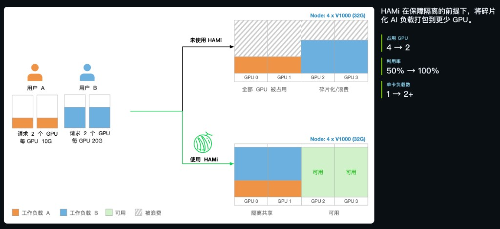
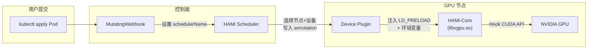
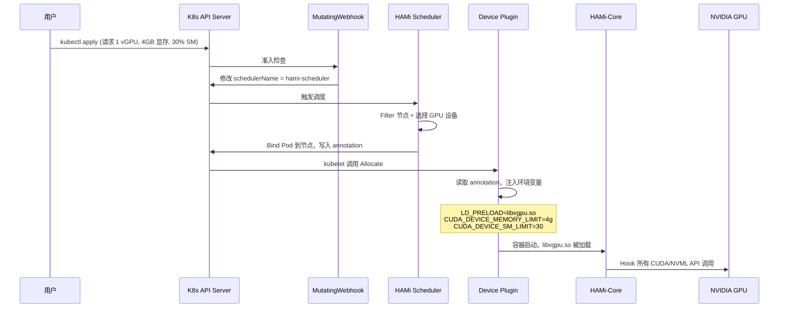
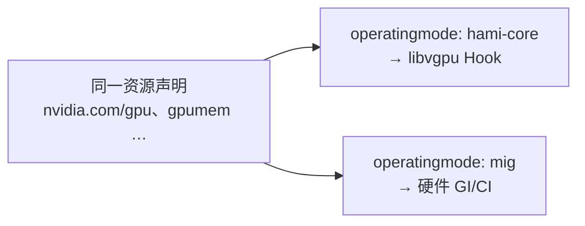
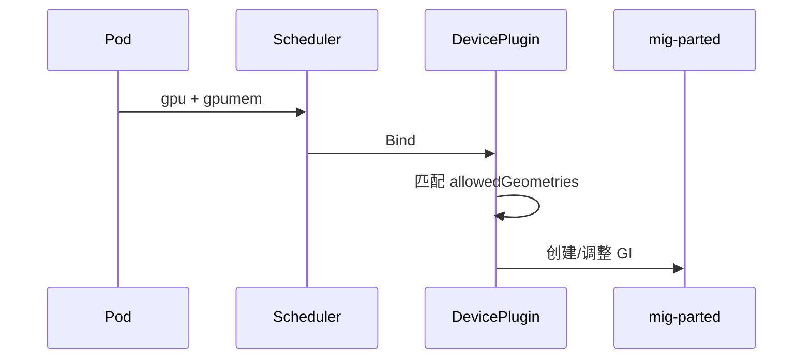
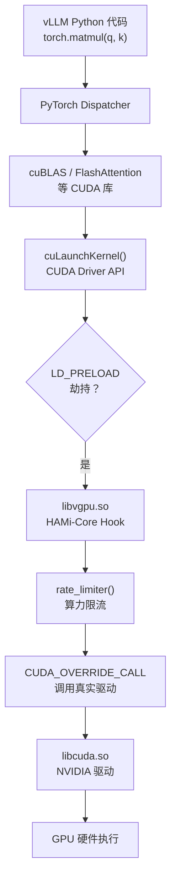
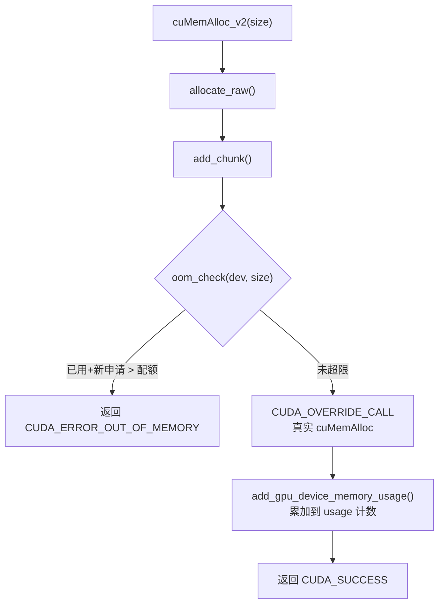
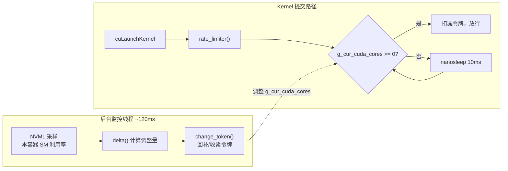

# HAMi GPU 虚拟化深度解析：从原理到实践

> 本文从行业痛点出发，逐层深入 HAMi 的系统架构、HAMi-Core 的源码实现（显存硬限制与算力软限制）、可选的 **NVIDIA MIG 路径**与 **Dynamic MIG** 配置含义、第三方基准测试数据，最后给出在 Kubernetes 集群上落地 HAMi 的完整实操步骤。

## 一、为什么需要 GPU 虚拟化

### 1.1 GPU 利用率的尴尬现状

在生产环境中，GPU 的平均利用率往往令人失望。一个典型场景：团队部署了一个基于 vLLM 的推理服务，申请了一整张 A100（80GB 显存），但实际推理负载只需要 15GB 显存、20% 的算力。剩余资源完全闲置，其他团队却排队等卡。

这种"整卡独占"模式在推理、开发调试、小模型训练等场景中普遍存在，造成了巨大的资源浪费。



*图片来源：[HAMi 官网](https://project-hami.io/zh/)（页面截图）。*

### 1.2 现有方案对比

| 方案 | 类型 | 隔离性 | 适用 GPU | 动态调整 | 成本 |
|------|------|--------|----------|----------|------|
| **NVIDIA MIG** | 硬件级分区 | 强（硬件隔离） | 仅 A100/A30/H100/H200 | 需重启 | 免费 |
| **NVIDIA vGPU** | 驱动级虚拟化 | 中 | NVIDIA 全系列 | 支持 | 按卡收费 |
| **Time-Slicing** | 时间片轮转 | 无隔离 | NVIDIA 全系列 | 支持 | 免费 |
| **HAMi** | 软件级 Hook | 中（显存硬+算力软） | 全系列 GPU（含 AMD） | 支持 | 免费开源 |

MIG 隔离性最强，但只支持高端数据中心 GPU，且分区配置固定（如 A100 只能切成 1g.10gb / 2g.20gb 等有限规格）。Time-Slicing 没有任何资源隔离，多个 Pod 会互相抢占。

**HAMi 的定位**是：在不修改驱动、不依赖特定硬件的前提下，通过用户态 Hook 实现显存硬限制和算力软限制，适用于所有 CUDA 兼容 GPU。它是 CNCF Sandbox 项目，当前最新版本为 v2.8.0。

## 二、HAMi 整体架构

从请求入口、控制面决策到数据面注入与 HAMi Core 隔离执行的链路，可参考官方站点的「HAMi 运行时机制」示意图（与下文各组件文字说明互补）。


*图片来源：[HAMi 官网](https://project-hami.io/zh/)（页面截图）。*

HAMi 由四个核心组件协同工作：



### 2.1 各组件职责

**MutatingWebhook**：拦截 Pod 创建请求，扫描资源字段。如果 Pod 请求了 `nvidia.com/gpu`、`nvidia.com/gpumem` 等 HAMi 资源，自动将 `schedulerName` 设为 `hami-scheduler`，让 HAMi 调度器接管。

**HAMi Scheduler**：作为 Kubernetes Scheduler Extender 运行，实现 Filter 和 Bind 端点。它维护集群中所有异构计算设备的全局视图，根据调度策略（spread / binpack）选择最合适的节点和 GPU 设备，将结果写入 Pod 的 annotation。

**Device Plugin**：运行在每个 GPU 节点上，通过 gRPC 协议与 kubelet 通信（Registration、ListAndWatch、Allocate）。它从 Pod annotation 中获取调度结果，为容器注入 `LD_PRELOAD=libvgpu.so` 环境变量以及显存/算力限制参数（`CUDA_DEVICE_MEMORY_LIMIT`、`CUDA_DEVICE_SM_LIMIT`）。

**HAMi-Core (libvgpu.so)**：这是真正在容器内生效的资源控制器——一个通过 `LD_PRELOAD` 注入的共享库，劫持 CUDA Driver API 和 NVML API，实现显存配额和算力限流。

### 2.2 一个 Pod 的完整生命周期



上图描述的是 **HAMi-Core** 路径；**MIG / Dynamic MIG / `knownMigGeometries`** 见 **§2.3**。

### 2.3 NVIDIA：HAMi-Core 与 MIG（含 Dynamic MIG）

HAMi 在调度与资源名上统一，在节点上仍对应 **两种** NVIDIA 底层路径——**不必**为了用 HAMi 而开 MIG。



| 路径 | 节点 `operatingmode` | 隔离特点 | 深入阅读 |
|------|----------------------|----------|----------|
| **HAMi-Core** | `hami-core`（常见默认） | 显存硬、算力软 | **§三** |
| **MIG** | `mig` | 硬件分区，边界更硬 | 本节 |

| 约束方式 | 说明 |
|----------|------|
| Pod 注解 | `nvidia.com/vgpu-mode: hami-core` / `mig`（可选） |
| 全局 | `nvidia.migstrategy`（如 `none` 等，见版本文档） |

#### `knownMigGeometries` 与 Dynamic MIG

| 项 | 含义 |
|----|------|
| `models` | 适用的 GPU 型号字符串 |
| `allowedGeometries` | **整卡** MIG 切分模板白名单；`name` / `memory` / `core` / `count` 描述 profile 与个数 |
| 与 `deviceSplitCount` | 后者仅 **HAMi-Core 软分片** 份数；**勿混用** |

**机制简述**：Dynamic MIG 指 device-plugin 按待调度任务，在 **`allowedGeometries`** 中 **按配置顺序** 匹配 **第一条** 能容纳资源请求的模板，并调用 **mig-parted** 在节点上 **创建或重建** GPU Instance——变化的是 **整卡上的 MIG 拓扑**，而不是在容器运行过程中热改单个实例的配额。§1.2 里「MIG 分区固定」指的是 **NVIDIA 只提供离散 profile**；HAMi 在此基础上解决的是 **集群里谁去切、何时切、如何与 Pod 声明对齐**。



#### Dynamic MIG 的好处（相对「人工静态切分」）

若不区分 **NVIDIA 原生 MIG** 与 **HAMi 的 Dynamic MIG**，容易误以为「硬件能切就够了」；实际上在 Kubernetes 里长期用手工 `nvidia-smi` / 固定模板运维，会遇到：**节点实际切法与调度器以为的可分配资源不一致**、**业务 YAML 与 `nvidia.com/mig-*` 资源类型强绑定**、**一种几何焊死导致整卡槽位或 profile 长期浪费** 等问题。HAMi 把「选型 + 落地」收进控制面后，主要收益可以概括为：

| 维度 | 好处说明 |
|------|----------|
| **运维** | 无需为每个租户 SSH 到节点切 MIG；改模板、扩缩容随 Pod 需求驱动，减少人肉操作与值班成本。 |
| **声明与调度一致** | Pod 仍使用 **`nvidia.com/gpu`、`nvidia.com/gpumem`** 等统一资源名（见[官方 Dynamic MIG 用户文档](https://project-hami.io/docs/userguide/NVIDIA-device/dynamic-mig-support)），不必让业务去选 `nvidia.com/mig-1g.5gb` 这类与拓扑强耦合的 Extended Resource，降低应用与集群契约的复杂度。 |
| **资源池形态** | **MIG 节点**与 **HAMi-Core 节点**可纳入同一调度视图，任务可通过注解偏好模式或按需分配，便于混部与逐步演进。 |
| **利用率与弹性** | 在 **`allowedGeometries` 白名单**内，可按队列中的任务类型在多种「整卡几何」间切换（例如从大实例为主切到多小实例为主），减轻「一种切法管一年」造成的 profile 与真实负载不匹配。 |
| **治理与边界** | `knownMigGeometries` 明确 **允许哪些切法**、**匹配顺序**（首条命中），集群管理员可约束「只许 A100 使用这几套几何」，避免任意 profile 组合带来的不可预期与排障困难。 |

**需要区分的两点**：一是 **隔离质量**仍由 **MIG 硬件**保证，Dynamic MIG 不改变「比 HAMi-Core 更硬」这一事实；二是 **好处主要来自平台与运维层**，若业务始终只需要一种静态几何且由 IaC 严格管理，收益会相对不明显——此时价值更多体现在 **与 HAMi 统一资源模型、少一套手工流程** 上。

> 实战 **§5.3** 的 YAML 侧重 HAMi-Core 常用项；`knownMigGeometries` 在同 ConfigMap 的 `nvidia:` 下配置，改后重启 scheduler / 相关 device-plugin。

## 三、HAMi-Core 源码深度解析

HAMi-Core 的源码位于 [HAMi-core 仓库](https://github.com/Project-HAMi/HAMi-core)。它的核心能力可以分为三个层面：Hook 机制、显存控制、算力控制。

### 3.1 Hook 机制：LD_PRELOAD 劫持 CUDA 调用

#### 从 Python 代码到 GPU 硬件的完整调用链

当你用 vLLM 跑推理时，一次矩阵乘法在底层会经过这样的链路：



关键概念解释：

- **CUDA Kernel**：GPU 上执行的一次大规模并行计算任务。无论是矩阵乘法、Attention 计算还是 LayerNorm，底层都会被编译成一个或多个 kernel。
- **`cuLaunchKernel`**：CUDA 驱动级 API，负责将一个 kernel "提交"给 GPU 执行。所有框架（PyTorch、TensorFlow、cuBLAS 等）最终都会调用这个 API。
- **`LD_PRELOAD`**：Linux 动态链接器机制。设置 `LD_PRELOAD=libvgpu.so` 后，程序在解析 `cuLaunchKernel` 等符号时，会优先在 `libvgpu.so` 中查找，从而实现"劫持"。

#### Hook 的实现

HAMi-Core 的 `cuLaunchKernel` hook（`src/cuda/memory.c`）：

```c
CUresult cuLaunchKernel(CUfunction f,
    unsigned int gridDimX, unsigned int gridDimY, unsigned int gridDimZ,
    unsigned int blockDimX, unsigned int blockDimY, unsigned int blockDimZ,
    unsigned int sharedMemBytes, CUstream hStream,
    void** kernelParams, void** extra)
{
    ENSURE_RUNNING();
    pre_launch_kernel();
    if (pidfound == 1) {
        // 算力限流：根据 grid 维度（block 总数）扣减令牌
        rate_limiter(gridDimX * gridDimY * gridDimZ,
                     blockDimX * blockDimY * blockDimZ);
    }
    // 调用真正的 NVIDIA 驱动 API
    CUresult res = CUDA_OVERRIDE_CALL(cuda_library_entry,
        cuLaunchKernel, f,
        gridDimX, gridDimY, gridDimZ,
        blockDimX, blockDimY, blockDimZ,
        sharedMemBytes, hStream, kernelParams, extra);
    return res;
}
```

`CUDA_OVERRIDE_CALL` 宏通过 `dlsym(RTLD_NEXT, ...)` 获取 `libcuda.so` 中的原始函数指针，从而在 Hook 前后加入控制逻辑，最终仍然让真正的驱动去执行。**GPU 完全感知不到 HAMi 的存在**。

### 3.2 显存控制：配额式硬限制

显存控制的设计思路很直接：**在每次 `cuMemAlloc` 之前检查配额，超了就拒绝**。

#### 核心流程



`oom_check` 的实现（`src/allocator/allocator.c`）：

```c
int oom_check(const int dev, size_t addon) {
    uint64_t limit = get_current_device_memory_limit(d);  // 环境变量设的配额
    size_t _usage = get_gpu_memory_usage(d);               // 当前已用

    if (limit == 0) return 0;  // 未设限制，放行

    size_t new_allocated = _usage + addon;
    if (new_allocated > limit) {
        LOG_ERROR("Device %d OOM %lu / %lu", d, new_allocated, limit);
        return 1;  // 超限，拒绝
    }
    return 0;  // 未超限，放行
}
```

顺序是 **检查 → 分配 → 记账**：真实的 GPU 显存只有在 `oom_check` 通过后才会被驱动划走。因此**显存配额是硬限制，不会被突破**。

#### 多进程共享内存计量

每个进程的显存使用量记录在一块 `mmap` 的共享内存区域中（`shrreg_proc_slot_t` 结构），使用 C11 原子操作 + seqlock 协议保证并发读写一致性：

```c
// 写入（分配时）
atomic_fetch_add_explicit(&slot->seqlock, 1, memory_order_release);  // 奇数：写中
atomic_fetch_add_explicit(&slot->used[dev].total, usage, memory_order_release);
atomic_fetch_add_explicit(&slot->seqlock, 1, memory_order_release);  // 偶数：写完

// 读取（检查时）
do {
    seq1 = atomic_load_explicit(&slot->seqlock, memory_order_acquire);
    while (seq1 & 1) { /* 奇数=写中，等待 */ }
    proc_usage = atomic_load_explicit(&slot->used[dev].total, memory_order_acquire);
    seq2 = atomic_load_explicit(&slot->seqlock, memory_order_acquire);
} while (seq1 != seq2);  // 版本号不一致则重试
```

#### NVML Hook：伪造 `nvidia-smi` 显示

HAMi-Core 同时劫持了 `nvmlDeviceGetMemoryInfo`，让容器内的 `nvidia-smi` 显示的是**配额值而非整卡显存**（`src/nvml/hook.c`）：

```c
nvmlReturn_t _nvmlDeviceGetMemoryInfo(nvmlDevice_t device, void* memory, int version) {
    // 先调用真实 NVML API 获取硬件信息
    NVML_OVERRIDE_CALL(nvml_library_entry, nvmlDeviceGetMemoryInfo, device, memory);

    size_t usage = get_current_device_memory_usage(cudadev);
    size_t limit = get_current_device_memory_limit(cudadev);

    if (limit != 0) {
        // 篡改返回值
        ((nvmlMemory_t*)memory)->total = limit;       // total = 配额
        ((nvmlMemory_t*)memory)->used  = usage;       // used = 本容器已用
        ((nvmlMemory_t*)memory)->free  = limit - usage; // free = 差额
    }
    return NVML_SUCCESS;
}
```

所以你在容器内执行 `nvidia-smi`，看到的 `Memory-Usage: 0MiB / 4096MiB` 实际上是 HAMi 伪造的——**物理卡可能是 80GB，但你只能看到并使用配额内的 4GB**。

### 3.3 SM（算力）控制：反馈式令牌限流

与显存的硬限制不同，SM（Streaming Multiprocessor，流式多处理器）利用率控制是一个**基于反馈的软限制**。

#### 核心思路

HAMi-Core 采用"**令牌桶 + NVML 采样反馈**"的方式：

1. 维护一个全局令牌计数器 `g_cur_cuda_cores`
2. 每次 `cuLaunchKernel` 前，从计数器中**扣减**令牌（扣减量 = grid 维度乘积，即 block 总数）
3. 如果令牌不足（计数器 < 0），则 `nanosleep` 约 10ms 后重试
4. 后台线程每约 120ms 通过 NVML 采样本容器的实际 SM 利用率，与目标比较后**补充或收紧**令牌



#### `rate_limiter`：提交前的限流关卡

```c
void rate_limiter(int grids, int blocks) {
    long kernel_size = grids;

    // SM 限制为 100% 或未设置时，直接放行
    if ((get_current_device_sm_limit(0) >= 100) ||
        (get_current_device_sm_limit(0) == 0))
        return;

    do {
CHECK:
        before_cuda_cores = g_cur_cuda_cores;
        if (before_cuda_cores < 0) {
            nanosleep(&g_cycle, NULL);  // 约 10ms
            goto CHECK;                  // 重试
        }
        after_cuda_cores = before_cuda_cores - kernel_size;
    } while (!CAS(&g_cur_cuda_cores, before_cuda_cores, after_cuda_cores));
}
```

#### `delta`：反馈调节的核心算法

```c
long delta(int up_limit, int user_current, long share) {
    int utilization_diff =
        abs(up_limit - user_current) < 5 ? 5 : abs(up_limit - user_current);
    long increment =
        (long)g_sm_num * (long)g_sm_num *
        (long)g_max_thread_per_sm * (long)utilization_diff / 2560;

    // 大偏差时加速调节
    if (utilization_diff > up_limit / 2) {
        increment = increment * utilization_diff * 2 / (up_limit + 1);
    }

    if (user_current <= up_limit) {
        share = min(share + increment, g_total_cuda_cores);  // 低于目标 → 多补
    } else {
        share = max(share - increment, 0);                    // 高于目标 → 收紧
    }
    return share;
}
```

**几个关键设计决策**：

- **死区**：`utilization_diff` 最小为 5，即便误差很小也会有调节动作，防止静态不动
- **大偏差加速**：当偏差超过目标的一半时，`increment` 会被放大，加快收敛
- **采样周期**：当前 HAMi-core 实现中 `g_wait` = 120ms，作为 NVML 反馈周期；GPU-Virt-Bench 论文在描述监控开销时采用 **100ms** 作为可配置默认值——以实际加载的 **libvgpu.so 版本**为准

#### 必须理解的限制

SM 控制是**软限制**，而非硬限制：

- **短时间内可以超过目标值**：因为 120ms 采样周期内的 kernel 已经在 GPU 上执行，无法撤回
- **存在振荡**：反馈回路天然有滞后，实际利用率可能在目标值上下波动
- **大偏差时波动更明显**：突发负载会导致利用率先冲高再回落
- 据 GPU-Virt-Bench 论文的测试，**SM 控制精度约为 85%**

### 3.4 显存 vs 算力控制对比

| 维度 | 显存控制 | SM（算力）控制 |
|------|---------|--------------|
| 机制 | 配额拒绝（超限 → OOM） | 速率限制（超限 → 延迟提交） |
| 限制类型 | **硬限制** | **软限制** |
| 精度 | 精确到字节 | 约 85%（有振荡） |
| `nvidia-smi` 显示 | 被 Hook 伪造为配额值 | 显示实际利用率 |
| 波动 | 无 | 有（受采样周期和负载突变影响） |

## 四、性能影响

性能数据来自 GPU-Virt-Bench 基准测试框架（arXiv:2512.22125，2025 年 12 月发布），该论文对 HAMi-core 与 BUD-FCSP 等方案进行了 56 项指标的系统测试。

> 注：GPU-Virt-Bench 中 LLM 相关测试使用的是模拟 Transformer 模式的自定义 CUDA kernel，而非完整的 PyTorch/vLLM 框架，结果应作为参考而非绝对值。

### 4.0 测试条件（论文 §7.1，读表前必读）

下列 **§4.1～§4.4** 中的数值来自论文在**固定环境**下跑出的结果：**NVIDIA A100-40GB PCIe**、CUDA **12.0**、指定驱动与 OS；对 HAMi-core 使用 **`--memory-limit 4096 --compute-limit 50`** 等资源参数参与基准。**硬件、驱动、CUDA 或限制参数变化时，只宜作量级参考**，不宜直接等同于你在生产集群上的实测。

**综合得分（§4.4）** 是论文按权重聚合多类指标后的 **「相对理想 MIG 行为的归一化得分」**，不是「裸算力百分比」；**Native** 行表示无虚拟化时的性能上限参考。

### 4.1 开销指标

下表与论文 Table 4 一致（单位 μs，Hook 为 ns；FCSP 列为 BUD-FCSP）：

| 指标 | Native（无虚拟化） | HAMi-core | BUD-FCSP | 备注 |
|------|-------------------|-----------|----------|------|
| Kernel Launch 延迟 | 4.2 μs | 15.3 μs | 8.7 μs | HAMi 相对 Native 约 3.6× |
| 内存分配 (Alloc, OH-002) | 12.5 μs | 45.2 μs | 28.3 μs | 常规 `cuMemAlloc` 完成时间 |
| 内存释放 (Free, OH-003) | 8.1 μs | 32.4 μs | 18.6 μs | |
| Context 创建 (OH-004) | 125 μs | 312 μs | 198 μs | |
| Hook 单次开销 (OH-005) | — | 85 ns | 42 ns | dlsym / 解析路径 |
| **综合吞吐损耗 (OH-010)** | 0% | **18.5%** | **9.2%** | 端到端吞吐劣化 |

### 4.2 隔离质量（4 个并发租户）

与论文 Table 5 一致：

| 指标 | HAMi-core | BUD-FCSP |
|------|-----------|----------|
| 显存限制精度 | 98.2% | 99.1% |
| SM 利用率控制精度 | 85.4% | 92.7% |
| 公平性指数 | 0.87 | 0.94 |
| 吵邻干扰率 | 24.3% | 12.1% |
| 故障隔离 | Pass | Pass |

### 4.3 LLM 推理负载（相对 Native）

与论文 Table 6 一致（**合成** CUDA 负载，非完整 vLLM 栈）：

| 指标 | HAMi-core | BUD-FCSP |
|------|-----------|----------|
| Attention 算子性能 | 82.3% | 91.5% |
| KV Cache 操作性能 | 76.4% | 88.2% |
| TTFT（首 Token 延迟） | 45.2 ms | 28.7 ms |
| ITL（Token 间延迟） | 12.8 ms | 8.4 ms |
| Batch 扩展效率 | 0.78 | 0.89 |

### 4.4 综合评分

与论文 Table 7 一致。**「MIG Parity」** 在论文中表示相对 **MIG-Ideal** 模拟基线的综合接近程度。

| 系统 | 综合得分 | 等级 |
|------|---------|------|
| MIG-Ideal（硬件隔离基线） | 100% | A+ |
| Native（无虚拟化） | 100% | A+ |
| **BUD-FCSP** | **85.2%** | **B+** |
| **HAMi-core** | **72.0%** | **C** |

**BUD-FCSP** 并非 **Project-HAMi / HAMi-core 官方主线**的发布名，而是 **Bud Ecosystem** 在论文与 [GPU-Virt-Bench](https://github.com/BudEcosystem/GPU-Virt-Bench) 中给出的、**与 HAMi-core API 兼容**的增强型软件虚拟化后端；选型时需对照其许可、分发渠道与上游 HAMi 的关系，勿与 CNCF 仓库默认产物混为一谈。

论文总结：**软件虚拟化方案对一般负载常出现约 10–20% 量级的吞吐相关损耗**（具体见 OH-010），是否可接受取决于利用率与成本权衡。

### 4.5 BUD-FCSP：论文中的定位与相对 HAMi-core 的差异

**命名**：论文 §2.3.2 将 **BUD-FCSP** 写作 *Fine-grained Container-level SM Partitioning*；厂商站点也使用 **Fixed Capacity Spatial Partition（FCSP）** 等表述——**全称以论文与 [Bud Ecosystem 文档](https://budecosystem.com/bud-fcsp) 为准**，不必强行合并成单一译名。

论文在 §2.3.2 中归纳的相对 **HAMi-core** 的改进方向包括：**更细粒度的 SM 利用率控制**、**降低 API 拦截 / dlsym 路径开销**、**改进的令牌桶与突发处理**、**多租户公平性（如加权公平调度思想）** 等；并与 Table 4～7 的实测一致：**Kernel Launch** 自 HAMi 的 15.3 μs 降至 FCSP 的 8.7 μs（约 **43%**）、**OH-010** 自 18.5% 降至 9.2%、**吵邻干扰率**自 24.3% 降至 12.1%。

**勿与 §4.1 混淆的另一类指标**：论文指标 **IS-002（Memory Limit Enforcement）** 度量的是「**尝试超额分配时，从发起分配到被拒绝/失败的时间**」，与 **OH-002（单次 cuMemAlloc 正常路径延迟）** 不是同一件事。Bud 侧公开材料中常给出 **HAMi 约 1.1 ms、FCSP 约 0.3 μs** 一类的 **IS-002 量级对比**（并宣称约 **3600×** 差距）；**该对数字未出现在论文 Table 4～7 的表格中**，若引用请标明来自 **Bud Ecosystem / FCSP 产品说明**，并与 §4.1 的 **Alloc 45.2 μs** 区分。

**实现细节**：部分产品文档还会提到 **Stream 分类、NCCL 与计算/通信路径区分** 等，用于减轻通信类 kernel 被算力限流误伤；**论文 §2.3.2 未逐项展开**，部署时以 Bud 与具体版本文档为准。

## 五、实操指南：在 K8s 集群上部署 HAMi

### 5.1 环境准备

#### 前置条件

| 依赖 | 最低版本 |
|------|---------|
| NVIDIA Driver | >= 440 |
| CUDA | >= 10.2 |
| Kubernetes | >= 1.18 |
| Helm | >= 3.0 |
| nvidia-container-toolkit | 已安装并配置为默认运行时 |
| glibc | >= 2.17 且 < 2.30 |
| Kernel | >= 3.10 |

#### Step 1: 安装 nvidia-container-toolkit

```bash
# Debian/Ubuntu
distribution=$(. /etc/os-release; echo $ID$VERSION_ID)
curl -s -L https://nvidia.github.io/libnvidia-container/gpgkey | sudo apt-key add -
curl -s -L https://nvidia.github.io/libnvidia-container/$distribution/libnvidia-container.list \
    | sudo tee /etc/apt/sources.list.d/libnvidia-container.list
sudo apt-get update && sudo apt-get install -y nvidia-container-toolkit
```

#### Step 2: 配置容器运行时

**Docker 方式**：

```bash
sudo nvidia-ctk runtime configure --runtime=docker
sudo systemctl daemon-reload && sudo systemctl restart docker
```

或手动编辑 `/etc/docker/daemon.json`：

```json
{
    "default-runtime": "nvidia",
    "runtimes": {
        "nvidia": {
            "path": "/usr/bin/nvidia-container-runtime",
            "runtimeArgs": []
        }
    }
}
```

**containerd 方式**：

```bash
sudo nvidia-ctk runtime configure --runtime=containerd
sudo systemctl daemon-reload && sudo systemctl restart containerd
```

#### Step 3: 给 GPU 节点打标签

```bash
kubectl label nodes <your-gpu-node-name> gpu=on
```

> 没有这个标签的节点不会被 HAMi 调度器管理。

### 5.2 Helm 安装 HAMi

```bash
# 添加 Helm 仓库
helm repo add hami-charts https://project-hami.github.io/HAMi/
helm repo update

# 查看 K8s 版本（用于匹配 scheduler image tag）
kubectl version --short

# 安装 HAMi（将 v1.28.0 替换为你的 K8s 版本）
helm install hami hami-charts/hami \
    --set scheduler.kubeScheduler.imageTag=v1.28.0 \
    -n kube-system
```

#### 验证安装

```bash
# 确认 Pod 全部 Running
kubectl get pods -n kube-system | grep hami

# 预期输出：
# hami-device-plugin-xxxxx   1/1   Running   0   1m
# hami-scheduler-xxxxx       2/2   Running   0   1m
```

### 5.3 ConfigMap 关键参数

安装后可以通过 ConfigMap 调整全局策略：

```bash
kubectl edit configmap hami-scheduler-device -n kube-system
```

核心配置项：

```yaml
nvidia:
  # 每张 GPU 最多拆分的虚拟设备数量，默认 10
  deviceSplitCount: 10

  # 显存超配比例，默认 1（不超配）
  # 设为 2 表示物理 80GB 的卡可以被调度为 160GB（实际仍只有 80GB，超配需谨慎）
  deviceMemoryScaling: 1

  # Pod 未指定显存时的默认分配（MB），0 表示使用 100% 显存
  defaultMem: 0

  # Pod 未指定算力时的默认 SM 百分比，0 表示不限制
  defaultCores: 0

  # 是否禁用算力限制，默认 false
  disablecorelimit: "false"

  # MIG 几何白名单（仅 MIG 节点；含义见 §2.3）
  # knownMigGeometries: ...
```

#### 调度策略

通过 Helm values 或 `--set` 配置：

```bash
# GPU 调度策略：spread（分散到不同 GPU）或 binpack（尽量装满同一张 GPU）
--set scheduler.defaultSchedulerPolicy.gpuSchedulerPolicy=binpack

# 节点调度策略：binpack（同节点）或 spread（分散节点）
--set scheduler.defaultSchedulerPolicy.nodeSchedulerPolicy=spread
```

**推荐**：推理场景用 `binpack`（节省卡数），训练场景用 `spread`（减少干扰）。

### 5.4 LeaderWorkerSet + vLLM（HAMi GPU 切分）

结合 **TAI Admission Webhook** (实现用户指定调度具体卡和节点) 测试 HAMi GPU 切分。需集群已安装 **TAI Admission Webhook** 和 [LeaderWorkerSet](https://lws.sigs.k8s.io/)（CRD `leaderworkerset.x-k8s.io/v1`），且 **HAMi** 与 **`hami-scheduler`** 已按上文就绪。

#### 模型路径与挂载

若权重在对象存储，为提高启动速度，可在各 GPU 节点把同一套模型同步到**相同本地路径**（下例为 `/data01/models/DeepSeek-R1-Distill-Qwen-1.5B`），再在 Pod 里用 **`hostPath`** 挂到容器内 **`/data/model`**，`--model` 指向该目录。要点：各节点路径一致；**`hostPath`** 直接把节点目录挂进容器，调度到某节点时该路径必须已存在且可读。

#### 调度与 GPU 分配（示例）

- **Leader**（`…-0`）：节点 **gpu-3** 上 **GPU 0、1**（UUID 见测试文档中的 gpu-3 表）。
- **Worker 1**（`…-0-1`）：**gpu-4** 上 **GPU 0、1**。
- **Worker 2**（`…-0-2`）：**gpu-4** 上 **GPU 2、3**（同节点另一对卡）。

#### vLLM 与多卡

每 Pod **`nvidia.com/gpu: "2"`**，与 **`--tensor-parallel-size 2`** 一致；**`scheduler.tai.io/affinity`** 里 **`gpuUuids`** 为英文逗号分隔的两张卡 UUID，且与 `limits` 中 GPU 个数一致。三个 Pod 各跑一套 OpenAI API Server；若需要单作业多机张量并行的单一 vLLM 集群，需按 vLLM 文档另行组网。

要点：**`nvidia.com/gpumem`** 下例为每卡 6GiB → `6144` MB、两卡合计 **`12288`**；**`schedulerName: hami-scheduler`**；**`scheduler.tai.io/affinity`** 的 key 为 Pod 名字（见 LWS 命名）；多卡时 **`gpuUuids`** 为逗号列表，**`limits.nvidia.com/gpu` 与 UUID 个数一致**。**不要**同时写 `nvidia.com/gpumem` 与 `nvidia.com/gpumem-percentage`。

创建 `lws-vllm.yaml`（LeaderWorkerSet 与 Service 同一文件，`---` 分隔）：

```yaml
apiVersion: leaderworkerset.x-k8s.io/v1
kind: LeaderWorkerSet
metadata:
  name: vllm-inference-test
  namespace: default
spec:
  replicas: 1
  startupPolicy: LeaderCreated
  leaderWorkerTemplate:
    size: 3
    restartPolicy: RecreateGroupOnPodRestart
    leaderTemplate:
      metadata:
        labels:
          role: leader
        annotations:
          scheduler.tai.io/affinity: |
            {
              "vllm-inference-test-0":   {"nodeName": "gpu-3", "gpuUuids": "GPU-dc42c687-eed5-1f8e-5c3e-36dff1c6f748,GPU-90c9c004-6663-d9e6-fc21-683920f378a2"},
              "vllm-inference-test-0-1": {"nodeName": "gpu-4", "gpuUuids": "GPU-2de91661-d5e8-ca7d-0553-f43598dbb55b,GPU-ba5307d5-abc3-6d1e-b1c6-3a4aab35f15a"},
              "vllm-inference-test-0-2": {"nodeName": "gpu-4", "gpuUuids": "GPU-7872920e-1295-f6d6-cba3-c39f90ad7e2f,GPU-9626b285-d0d3-f94b-32c4-8df730284b1a"}
            }
      spec:
        schedulerName: hami-scheduler
        restartPolicy: Always
        volumes:
          - name: model
            hostPath:
              path: /data01/models/DeepSeek-R1-Distill-Qwen-1.5B
              type: Directory
        containers:
          - name: leader
            image: harbor.example.cn/tai-dev/vllm-openai:v0.12.0
            command:
              - python3
              - -m
              - vllm.entrypoints.openai.api_server
            args:
              - --port
              - "8000"
              - --model
              - /data/model
              - --tensor-parallel-size
              - "2"
              - --gpu-memory-utilization
              - "0.85"
              - --max-model-len
              - "20096"
              - --max-num-seqs
              - "512"
              - --max-num-batched-tokens
              - "40960"
              - --block-size
              - "16"
              - --swap-space
              - "16"
              - --served-model-name
              - DeepSeek-R1-Distill-Qwen-1.5B
            volumeMounts:
              - name: model
                mountPath: /data/model
                readOnly: true
            resources:
              limits:
                nvidia.com/gpu: "2"
                nvidia.com/gpumem: "12288"
                nvidia.com/gpucores: "50"
              requests:
                nvidia.com/gpu: "2"
                nvidia.com/gpumem: "12288"
                nvidia.com/gpucores: "50"
    workerTemplate:
      metadata:
        annotations:
          scheduler.tai.io/affinity: |
            {
              "vllm-inference-test-0":   {"nodeName": "gpu-3", "gpuUuids": "GPU-dc42c687-eed5-1f8e-5c3e-36dff1c6f748,GPU-90c9c004-6663-d9e6-fc21-683920f378a2"},
              "vllm-inference-test-0-1": {"nodeName": "gpu-4", "gpuUuids": "GPU-2de91661-d5e8-ca7d-0553-f43598dbb55b,GPU-ba5307d5-abc3-6d1e-b1c6-3a4aab35f15a"},
              "vllm-inference-test-0-2": {"nodeName": "gpu-4", "gpuUuids": "GPU-7872920e-1295-f6d6-cba3-c39f90ad7e2f,GPU-9626b285-d0d3-f94b-32c4-8df730284b1a"}
            }
      spec:
        schedulerName: hami-scheduler
        restartPolicy: Always
        volumes:
          - name: model
            hostPath:
              path: /data01/models/DeepSeek-R1-Distill-Qwen-1.5B
              type: Directory
        containers:
          - name: worker
            image: harbor.xxx.cn/tai-dev/vllm-openai:v0.12.0
            command:
              - python3
              - -m
              - vllm.entrypoints.openai.api_server
            args:
              - --port
              - "8000"
              - --model
              - /data/model
              - --tensor-parallel-size
              - "2"
              - --gpu-memory-utilization
              - "0.85"
              - --max-model-len
              - "20096"
              - --max-num-seqs
              - "512"
              - --max-num-batched-tokens
              - "40960"
              - --block-size
              - "16"
              - --swap-space
              - "16"
              - --served-model-name
              - DeepSeek-R1-Distill-Qwen-1.5B
            volumeMounts:
              - name: model
                mountPath: /data/model
                readOnly: true
            resources:
              limits:
                nvidia.com/gpu: "2"
                nvidia.com/gpumem: "12288"
                nvidia.com/gpucores: "50"
              requests:
                nvidia.com/gpu: "2"
                nvidia.com/gpumem: "12288"
                nvidia.com/gpucores: "50"
---
apiVersion: v1
kind: Service
metadata:
  name: vllm-inference-test-api
  namespace: default
spec:
  type: ClusterIP
  selector:
    leaderworkerset.sigs.k8s.io/name: vllm-inference-test
    role: leader
  ports:
    - name: http
      port: 8000
      targetPort: 8000
      protocol: TCP
```

`12288` MB 表示两卡各 6GiB 的 HAMi 显存切分（`6144`×2）；`gpucores` 为算力百分比。集群内访问 leader 上 OpenAI 端口：**`http://vllm-inference-test-api.default.svc.cluster.local:8000`**（若改了 `namespace` / Service 名，请相应替换）。

### 5.5 提交、验证与实战结果

#### 提交清单

```bash
kubectl apply -f lws-vllm.yaml
```

#### 一次实测记录（仅供参考）

以下为某环境实测：通过可路由的 ClusterIP / NodePort 地址访问（示例 IP `10.233.16.67`），**OpenAI HTTP 服务在容器 `8000`**。**`--served-model-name`** 为 `DeepSeek-R1-Distill-Qwen-1.5B` 时，请求里的 `model` 须与之一致，否则会返回 `The model ... does not exist`。

列出模型：

```text
$ curl -k -X GET "http://10.233.16.67:8000/v1/models"
{"object":"list","data":[{"id":"DeepSeek-R1-Distill-Qwen-1.5B","object":"model","created":1775658203,"owned_by":"vllm","root":"/data/model","parent":null,"max_model_len":20096,"permission":[{"id":"modelperm-b4e18f83b796c13f","object":"model_permission","created":1775658203,"allow_create_engine":false,"allow_sampling":true,"allow_logprobs":true,"allow_search_indices":false,"allow_view":true,"allow_fine_tuning":false,"organization":"*","group":null,"is_blocking":false}]}]}
```


```text
$ curl -k -X POST "http://10.233.16.67:8000/v1/completions" \
  -H "Content-Type: application/json" \
  -d '{"model": "DeepSeek-R1-Distill-Qwen-1.5B", "prompt": "人工智能是", "max_tokens": 50, "temperature": 0.0}'
{"id":"cmpl-b8768f532354ba25","object":"text_completion","created":1775658278,"model":"DeepSeek-R1-Distill-Qwen-1.5B","choices":[{"index":0,"text":"研究人工智能的科学，包括人工智能的理论、方法、技术以及应用领域。人工智能的理论包括人工智能的定义、人工智能的特征、人工智能的分类、人工智能的优缺点等。人工智能的特征包括人工智能的可解释性、可","logprobs":null,"finish_reason":"length","stop_reason":null,"token_ids":null,"prompt_logprobs":null,"prompt_token_ids":null}],"service_tier":null,"system_fingerprint":null,"usage":{"prompt_tokens":3,"total_tokens":53,"completion_tokens":50,"prompt_tokens_details":null},"kv_transfer_params":null}
```

Pod 分布（命名空间以你集群为准；下例中 leader 在 **`default`**，两个 worker 在 **`default`**）：

```text
$ kubectl get pods -A -o wide | grep inf
default     vllm-inference-test-0     1/1   Running   0   26m   10.233.71.81   gpu-3   ...
default     vllm-inference-test-0-1   1/1   Running   0   26m   10.233.72.87   gpu-4   ...
default     vllm-inference-test-0-2   1/1   Running   0   26m   10.233.72.86   gpu-4   ...
```

在 leader Pod 内查看 GPU：两张 A100 各约 **11491MiB / 12288MiB**，与 HAMi 两卡各 6GiB 配额（合计 12288MiB）一致。

```text
$ kubectl exec -it vllm-inference-test-0 -n kjdefault -- sh
# nvidia-smi
Wed Apr  8 07:38:33 2026
+-----------------------------------------------------------------------------------------+
| NVIDIA-SMI 550.163.01             Driver Version: 550.163.01     CUDA Version: 12.9     |
|   0  NVIDIA A100-PCIE-40GB   ...  | 11491MiB / 12288MiB | ...
|   1  NVIDIA A100-PCIE-40GB   ...  | 11491MiB / 12288MiB | ...
+-----------------------------------------------------------------------------------------+
| Processes:                                                                              |
|   （空闲时进程表可为空）                                                                 |
+-----------------------------------------------------------------------------------------+
```

#### 日志与常见问题

通过环境变量 `LIBCUDA_LOG_LEVEL` 控制 HAMi-Core 日志（`0`～`4`，排查时可设为 `4`）。**Pod 一直 Pending**：`kubectl describe node`、查看 **hami-scheduler** 日志。**容器内看不到显存限制**：确认 Device Plugin 与 `LD_PRELOAD` / `CUDA_DEVICE_MEMORY_LIMIT`。**更新配额不生效**：重建 Pod 并清理节点上 HAMi-Core 本地缓存（见官方排障说明）。

```bash
kubectl logs -n kube-system $(kubectl get pods -n kube-system -l app=hami-scheduler -o name) -c kube-scheduler
```

## 六、总结与建议

### 适用场景

- **推理服务**：多个小模型共享一张 GPU，充分利用显存和算力
- **开发调试**：开发人员按需获取 GPU 资源，无需独占整卡
- **多租户环境**：不同团队共享 GPU 集群，通过配额实现资源治理
- **需要硬件级隔离的数据中心卡（A100/A30/H100 等）**：**§2.3** 所述 **MIG 节点**与 Dynamic MIG；与 HAMi-Core 节点共用 `nvidia.com/gpu`、`nvidia.com/gpumem` 等声明

### 不适用场景

- **对尾延迟极端敏感**的实时推理（HAMi 的 Hook 引入约 3.6 倍 kernel launch 开销）
- **需要硬隔离 SLA 保证**的场景（SM 控制精度约 85%，存在吵邻干扰）
- **大规模分布式训练**（NCCL 通信可能被 `rate_limiter` 误伤）

### 选型建议

| 场景 | 推荐方案 |
|------|---------|
| 有 A100/H100，需要硬隔离 | NVIDIA MIG |
| 通用 GPU，接受 10-20% 损耗 | HAMi |
| LLM 推理，追求更低虚拟化开销（论文中的 FCSP 路径） | BUD-FCSP（Bud Ecosystem，与上游 HAMi-core 非同一交付物） |
| 混合 GPU 集群（NVIDIA + AMD） | HAMi（支持异构设备） |

### 最后

HAMi 作为 CNCF Sandbox 项目，提供了一种**无需硬件支持、无需修改驱动、对应用完全透明**的 GPU 虚拟化方案。它的核心价值在于：通过 `LD_PRELOAD` 劫持 CUDA API，在用户态实现显存配额和算力限流，让一张物理 GPU 被多个容器安全共享。

理解它的边界同样重要：显存是硬限制，精确可靠；算力是软限制，存在振荡和约 15% 量级的偏差（见 GPU-Virt-Bench 隔离类指标）。在选型时，需要根据业务对隔离性和延迟的要求，在 **HAMi-core / 上游 HAMi**、**NVIDIA MIG**、以及 **Bud Ecosystem 的 BUD-FCSP（论文中的增强后端）** 等方案之间做出权衡，并核对各方案的分发与维护主体。

---

**参考资料**：
- [HAMi 官方文档 v2.8.0](https://project-hami.io/docs/)
- [HAMi：Enable dynamic MIG feature](https://project-hami.io/docs/userguide/NVIDIA-device/dynamic-mig-support)
- [HAMi：Dynamic MIG 实现说明（开发者）](https://project-hami.io/docs/developers/dynamic-mig/)
- [HAMi-core 源码](https://github.com/Project-HAMi/HAMi-core)
- [GPU-Virt-Bench: A Comprehensive Benchmarking Framework for Software-Based GPU Virtualization Systems (arXiv:2512.22125)](https://arxiv.org/html/2512.22125v1)
- [BUD-FCSP: Fixed Capacity Spatial Partition](https://budecosystem.com/bud-fcsp)
