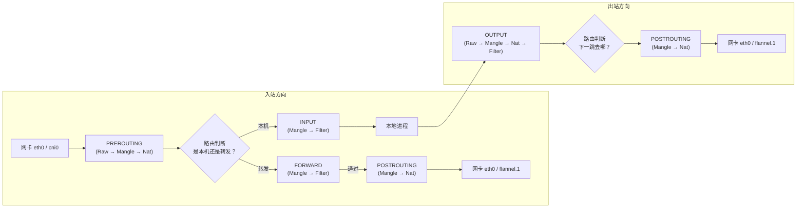
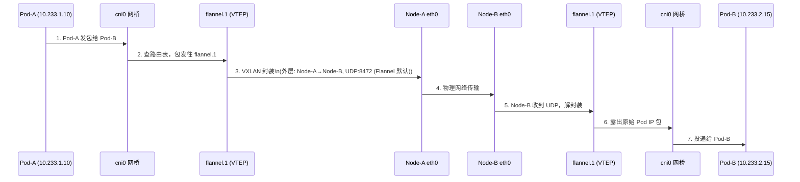
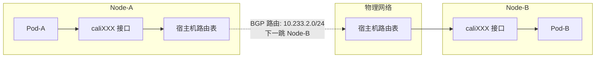
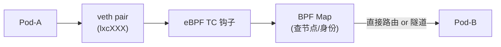
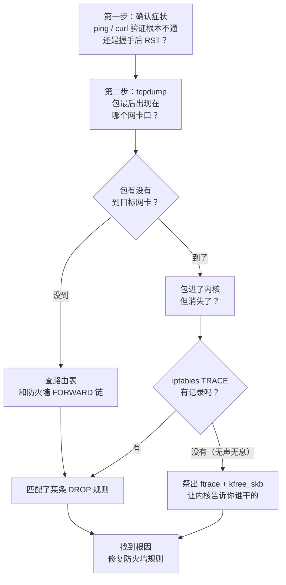

# Kubernetes Pod 网络数据包漂流记：从内核原理到实战排障

不知道你有没有遇到过这种诡异情况——Pod 里应用日志打 "Connection Timeout"，但同节点内的服务访问完全正常，一到跨节点或出公网就卡死。更奇怪的是，宿主机上直接 ping 其他节点 Pod IP 却是通的。

这种"同节点通、跨节点不通"的静默丢包，是 K8s 网络排障中最让人抓狂的场景。本文用图解 + 实战的方式，带你从 Pod 发包开始，一路追踪到内核深处，搞清楚数据包到底经历了什么、又在哪儿"失踪"。

文章分三块：先讲底层原理（Netfilter、CNI 流量路径），再用一个真实的 Docker+nftables 冲突案例演示排查全过程，最后总结一套可复用的方法论。文末另有一节 **建集群前的节点自检**：含 **单机 iptables / nftables 与 FORWARD 策略**（Part 2 同款坑）、**节点间封装探测**（IPIP / VXLAN / BGP 与云安全组）。如果你正被一个具体的 Timeout 问题困扰，可以直接跳到 Part 2 看案例；想系统理解 K8s 网络的话，建议从头开始。

---

# Part 1：技术原理——数据包到底经历了什么？

## 1.1 先说个故事：包的一生

假设我们有两个 Pod，分别跑在两台 Node 上：

```
Node-A 上的 Pod-A（IP: 10.233.1.10）
        ↓
   发一个包去
        ↓
Node-B 上的 Pod-B（IP: 10.233.2.15）
```

这个包从 Pod-A 出来，到达 Pod-B，中间要过多少关卡？

**比你想象的要多得多。**

整个旅程涉及：Pod 的虚拟网卡 → 宿主机的网桥/接口 → 内核路由表 → Netfilter 防火墙规则 → CNI 隧道封装 → 物理网卡 → 目标节点的解封装 → 最后才到 Pod-B。

下面我们一步一步拆开来看。

## 1.2 Linux 内核的"流水线"——Netfilter 钩子

不管你用哪种 CNI（Flannel、Calico、Cilium），数据包在 Linux 宿主机上都要走同一条"流水线"，这条流水线就是 **Netfilter**。

Netfilter 在数据包经过内核协议栈时，提供了 5 个"安检口"（Hook）：



**几个关键点：**

- **PREROUTING**：常用于 DNAT（目标地址转换），K8s 中 kube-proxy 把 ClusterIP 转成具体 Pod IP 就发生在这里。
- **FORWARD**：**跨节点 Pod 通信的命门**。数据包从本机一个网卡进来，要从另一个网卡出去，就走这条链。如果这里被 DROP，包就无声无息地消失了。
- **POSTROUTING**：常用于 SNAT，比如 Pod 访问集群外部时，把源 IP 伪装（MASQUERADE）成宿主机的物理网卡 IP。

> **排查提示**：`net.ipv4.ip_forward` 必须为 1，否则内核根本不转发任何包。另外注意 `iptables -L -v -n` 看一下 FORWARD 链的默认策略是 ACCEPT 还是 DROP。

### iptables 和 nftables 的"双保险"陷阱

现在很多新系统默认启用了 `nftables`（比如 Ubuntu 22.04+），但 K8s 组件（kube-proxy）大量使用 `iptables`。

**巨坑来了**：两套规则必须**同时通过**。假设 nftables 的 FORWARD 链默认策略是 DROP，iptables 显示 ACCEPT——包在 iptables 那里过了，但在 nftables 那里被静默丢弃。这就是"静默丢包"最常见的原因之一。

## 1.3 主流 CNI 的流量路径对比

不同的 CNI 构建网络的思路完全不同，导致数据包经过的"道路"也不一样。

### 2.1 Flannel (VXLAN 模式)——穿隧道的高速公路

Flannel 是最早也是最经典的 CNI，VXLAN 模式通过在内核中建立 UDP 隧道，把 Pod 的 IP 包封装起来传输。



**抓包位置总结**：

| 排查点 | 命令 | 看什么 |
|--------|------|--------|
| Pod 的包到没到宿主机 | `tcpdump -i cni0 host 10.233.x.x` | 源/目的 IP 是否正确 |
| 包进没进隧道 | `tcpdump -i flannel.1 host 10.233.x.x` | 隧道内是否有包 |
| 物理网上有没有发出 | `tcpdump -i eth0 udp port 4789` | Node 间 UDP 封装包 |

### 2.2 Calico——用路由表指挥交通

Calico 走的是另一条路：不修隧道，而是把每台宿主机当成路由器，通过 BGP 协议同步路由表，让 Pod IP 直接在物理网络中可达。



Calico 有两种模式：

- **BGP 模式（纯三层）**：Pod 包不封装，直接从物理网卡发出。前提是底层网络允许这些 IP 路由——适合白盒可控的私有集群。
- **IPIP 模式（封装）**：包套一层 IP-in-IP（协议号 4），外层用宿主机 IP 做源/目的。比 VXLAN 简单，但性能损耗类似。

### 2.3 Cilium——用 eBPF 抄近道

Cilium 是最新一代的 CNI，它用 **eBPF** 在内核的网卡层面直接处理包，**大幅绕过 iptables 和路由表**。



**关键差异**：eBPF 程序挂载在网卡的 tc ingress/egress 钩子及 XDP 层，数据包在出入网卡时就被 eBPF 拦截处理，不需要走完整的 Netfilter 流水线。所以传统的 `tcpdump` 在 Cilium 环境下可能抓不到这些包，需要用：

```bash
cilium monitor -v    # 监控 eBPF 层面的丢包和转发
hubble observe        # 带有 L7 协议解析的终极观测工具
```

---

# Part 2：实战案例——nftables FORWARD 静默丢包排查实录

下面这个案例来自 2026-04-22 的一个线上问题：一个之前装了 Docker 的 H800 机器组集群，nvdp-nvidia-device-plugin 等组件 Pod 突然无法启动。排查过程正好能印证 Part 1 讲的那些原理。

## 2.1 故障现象与初步判断

**环境背景**：3 master + 1 worker 的 K8s 集群，worker 节点 `worker1` 上多个组件 Pod（如 `nvdp-nvidia-device-plugin`）无法启动。

**症状表现**：
- Pod 内执行 `curl` 访问 APIServer 或跨节点 Pod 时，出现 `curl: (28) Connection timed out`
- 宿主机上 `ping` 其他节点的 Pod IP **正常**（说明底层 VXLAN 隧道没问题）

**关键发现**：通过连通性矩阵测试，发现流量只要不离开 `worker1` 节点就能通，一旦需要跨节点或出公网（需要经过 `FORWARD` 链）就会超时。

| 目标 | 路径类型 | 结果 |
| :--- | :--- | :--- |
| `worker1` 自身物理 IP | Pod -> `cni0` -> `vlan217` | **OK** (200) |
| `worker1` 自身 `cni0` IP | Pod -> `cni0` | **OK** (200) |
| 外部网络 (`8.8.8.8`) | Pod -> `cni0` -> SNAT -> 物理网卡 | **超时** |
| 跨节点 Pod IP (`10.233.66.2`) | Pod -> `cni0` -> FORWARD -> `flannel.1` (VXLAN) | **超时** |

**初步结论**：数据包在内核的 **FORWARD 阶段被静默丢弃**。

## 2.2 排查过程：从表层到内核深处

### Step 1：排除常见配置坑点

排查了以下常见疑点，均正常：

1. **接口层面的转发开关（sysctl）**：`net.ipv4.conf.*.forwarding` 均为 1
2. **VXLAN 邻居表与转发表（FDB）**：`flannel.1` 的 FDB 和 ARP 表项完整
3. **网卡卸载（Offload）**：关闭 checksum offload 后问题依旧

### Step 2：iptables TRACE 追踪——发现诡异现象

使用 `iptables -t raw -j TRACE` 追踪数据包，发现异常：

```
TRACE: raw:PREROUTING:rule:1 -> mangle:FORWARD:rule:2 -> filter:FORWARD:rule:3 (ACCEPT)
```

**诡异之处**：数据包通过了 `filter:FORWARD` 链的 ACCEPT 规则后，**没有到达任何 `POSTROUTING` 链**就消失了。

这与 Part 1 中提到的 Netfilter 流程矛盾——如果 FORWARD 链放行了，包应该继续流向 POSTROUTING。除非...

### Step 3：祭出 ftrace——让内核亲口告诉你

启用 `ftrace` 追踪 `kfree_skb`（内核丢弃数据包的函数）：

```bash
cd /sys/kernel/debug/tracing
echo 0 > tracing_on; echo > trace
echo 1 > events/skb/kfree_skb/enable
echo 1 > options/stacktrace
echo 'protocol == 2048' > events/skb/kfree_skb/filter
echo 1 > tracing_on
# 触发 curl 后关闭 tracing_on，提取 trace
```

**捕获到的关键调用栈**：

```
kfree_skb: skbaddr=00000000b089b447 protocol=2048 location=0000000050342fbe reason: NETFILTER_DROP
 <stack trace>
 => kfree_skb_reason
 => nf_hook_slow        <-- Netfilter 慢速路径钩子触发丢包
 => ip_forward          <-- 案发地点：IP 转发阶段 (对应 FORWARD 链)
```

**关键信息**：
- `reason: NETFILTER_DROP` —— 明确是防火墙丢弃
- `ip_forward` —— 发生在转发阶段

这与 iptables TRACE 看到的 "ACCEPT" 矛盾，说明系统中**存在另一套 Netfilter 前端**。

### Step 4：真相大白——nftables 的默认 DROP 策略

检查 `nftables` 规则集：

```bash
nft list ruleset
```

发现罪魁祸首：

```
table ip filter {
    chain FORWARD {
        type filter hook forward priority filter; policy drop;
        ...
    }
}
```

**根因分析**：
- Docker 调用的 `iptables-nft` 包装器在底层生成的 `nftables` 规则将 `FORWARD` 链默认策略设为 `drop`
- K8s 的 kube-proxy 和 Flannel 使用传统的 `iptables` 规则，并期望 `FORWARD` 链默认 ACCEPT
- 数据包必须通过 **iptables 和 nftables 的双重检查**
- 虽然 iptables 放行了，但 nftables 的默认 `drop` 策略将包静默丢弃

**这就是 Part 1 中提到的 "双保险陷阱" 的典型案例。**

## 2.3 解决方案与验证

临时恢复方案：

```bash
# 1. 确保 iptables FORWARD 策略为 ACCEPT
sudo iptables -P FORWARD ACCEPT

# 2. 在 nftables 中显式添加允许 FORWARD 的规则
sudo nft add rule ip filter FORWARD counter accept
```

执行后，Pod 跨节点通信瞬间恢复正常。

**长期建议**：对于纯粹只跑 Kubernetes 的节点，建议配置 Docker/containerd 不接管底层的 iptables/nftables 规则（如 Docker 配置中设置 `"iptables": false`），将网络完全交由 CNI 和 kube-proxy 管理。

> **⚠️ 避坑提示**：如果该节点除了跑 K8s 还需要用原生 Docker 构建镜像（`docker build`）或运行临时容器，设置 `"iptables": false` 会导致这些非 K8s 容器无法访问外网或 DNS 解析失败（因为缺少 MASQUERADE 规则）。这种情况下，更好的做法是保留 Docker 的 iptables 管理，但通过 systemd 显式将 FORWARD 策略改回 ACCEPT（例如在 `docker.service` 中添加 `ExecStartPost=/usr/sbin/iptables -P FORWARD ACCEPT`）。

---

# Part 3：方法论——网络排障的"三板斧"

看完原理和案例，最后总结一下遇到类似问题时该怎么系统地排查。

## 3.1 核心思路：层层设卡，验证包死在哪个环节

网络排障的本质是**缩小问题范围**，通过在不同网络层级设置"检查点"，逐步定位数据包消失的位置。

| 层级 | 工具 | 检查点 | 能发现的问题 |
|-----|------|-------|-------------|
| **网卡层** | `tcpdump` | 包是否到达指定接口 | 路由错误、接口 Down、Veth 损坏 |
| **防火墙层** | `iptables TRACE` / `nft monitor trace` | 包在 Netfilter 链中的流向 | 显式 DROP 规则、策略冲突 |
| **内核层** | `ftrace + kfree_skb` | 包被丢弃的精确位置和原因 | 静默丢包、默认策略 DROP、硬件校验错误 |

## 3.2 "三板斧"详解

### 第一板斧：tcpdump——网卡定位

**适用场景**：确认包是否到达某个网络接口。

```bash
# 验证 Pod 的包有没有到宿主机网桥
tcpdump -i cni0 host <目标 Pod IP> -n -nn

# 验证包有没有进入隧道设备（Flannel VXLAN）
tcpdump -i flannel.1 host <目标 Pod IP> -n -nn

# 验证物理网卡有没有发出封装包
tcpdump -i eth0 udp port 4789 -n -nn
```

**关键检查点**：
- 包"有没有"到达目标接口
- Source IP 是否正确（SNAT 问题）
- 对于 Cilium 环境，需改用 `cilium monitor -v` 或 `hubble observe`

### 第二板斧：iptables TRACE——防火墙追踪

**适用场景**：tcpdump 显示包进入接口但没从另一接口出来，怀疑被防火墙拦截。

```bash
# 给特定流量打上 TRACE 标签
iptables -t raw -I PREROUTING -d <目标 IP> -p tcp --dport <端口> -j TRACE

# 查看 TRACE 日志（不同系统日志位置可能不同）
tail -f /var/log/syslog | grep TRACE
# 或
nft monitor trace  # 新版内核
```

**局限性提醒**：
- TRACE 只能看到"显式规则"的匹配过程
- **默认策略 DROP**（如 nftables）不会在 TRACE 中显示，这就是"静默丢包"的诡异之处

### 第三板斧：ftrace + kfree_skb——内核追踪

**适用场景**：tcpdump 和 TRACE 都正常，但包就是消失了——终极武器。

```bash
cd /sys/kernel/debug/tracing
echo 0 > tracing_on; echo > trace
echo 1 > events/skb/kfree_skb/enable
echo 1 > options/stacktrace
echo 'protocol == 2048' > events/skb/kfree_skb/filter  # 过滤 IP 协议
echo 1 > tracing_on
# 触发故障流量后
echo 0 > tracing_on
cat trace
```

**关键信息解读**：
- `reason: NETFILTER_DROP` —— 防火墙丢弃
- `ip_forward` in stack —— 发生在转发阶段
- 与 TRACE 结果矛盾 —— 提示存在多套防火墙（如 nftables + iptables）

## 3.2 排查决策树

把上面的思路画成一张流程图，方便对照：



## 3.3 四句口诀

> **ping 不通查路由，握手 RST 查 SNAT。**
> **tcpdump 定点位，TRACE 追踪防火墙。**
> **离奇失踪用 ftrace，内核亲自告诉你。**

## 3.4 各工具能发现的问题汇总

| 排查层面 | 适用场景 | 核心工具 | 关注重点 |
|---------|---------|---------|---------|
| **连通性验证** | 区分根本不通 vs 握手后断开 | `ping`, `curl` | TTL、RST、Timeout |
| **网卡定位** | 确定包死在哪个接口 | `tcpdump` | Source IP 是否正确 |
| **防火墙追踪** | 包进内核后消失 | `iptables TRACE`, `nft monitor trace` | 规则匹配链 |
| **内核追踪** | TRACE 正常但包消失（静默丢包） | `ftrace + kfree_skb` | 调用栈、丢弃原因 |

---

## 建集群前的节点自检（单机防火墙、封装与云安全组）

装 K8s 之前，建议分三条线查：**同一台机器上** Netfilter 是否「两套规则打架」、**节点之间**封装/端口是否被云或中间网络拦、以及常规的 `ip_forward` 等（`kubeadm` 会看一部分 sysctl，但**不会**告诉你 `nft` 里 `FORWARD` 默认 `drop` 和 `iptables` 里 `ACCEPT` 谁说了算，也不会替你在云上试 **IPIP 协议号 4**）。

### 单机必查：iptables 与 nftables 别各说各话

Part 1 里写过：**iptables 和 nft 都是 Netfilter 的前端**，包往往要先后经过两套钩子；一边写着 `ACCEPT`、另一边链尾 `policy drop`，就会出现 **iptables TRACE 看着过了、Pod 跨节点照样超时** 的静默丢包（Part 2 的 Docker + K8s 节点就是这类）。

**装机 / 加节点进集群前，每台机器上都建议跑一遍：**

1. **看 nft 全局规则里 FORWARD 默认策略**

   ```bash
   sudo nft list chain ip filter FORWARD 2>/dev/null || true
   sudo nft list ruleset | less   # 或全文里搜 chain FORWARD、policy drop
   ```

   重点找 `chain FORWARD { ... policy drop;` 一类配置（`table ip filter` 若不存在则本机可能未用 nft 管 filter，仍以 `nft list ruleset` 为准）。若机器上装过 **Docker**，常见是 Docker 在 `table ip filter` 里建了 `FORWARD`，默认 **drop**，只放行 docker0 / 已建连等；**Pod 从 `cni0` 转发到 `flannel.1` 往往不在白名单里**，装完 CNI 才爆雷。

2. **看 iptables 侧 FORWARD 策略与残留**

   ```bash
   sudo iptables -S FORWARD
   sudo iptables -L FORWARD -n -v
   ```

   若默认策略是 `DROP`，或存在大段 `REJECT`/`DROP`，要和 nft 一起看：哪一侧最后给包判了死刑（有时 **iptables-nft** 与 **legacy** 表还混用，更乱）。

3. **确认本机到底在用哪套 `iptables` 用户态**

   ```bash
   readlink -f "$(command -v iptables)"
   # Debian/Ubuntu 还可：update-alternatives --display iptables
   ```

   `iptables-nft` 写的规则会进 **nft 规则集**，和 `nft list` 看到的是同一片内核状态；但若历史上跑过 **iptables-legacy** 又切到 Docker 的 **nft**，容易出现「文档里只查了其中一侧」的盲区。

4. **若节点当 K8s 用、不需要 Docker 管防火墙**：提前在 `daemon.json` 里设 `"iptables": false`（或按发行版文档卸载 Docker 对防火墙的接管），把 **FORWARD / NAT** 交给 CNI 与 kube-proxy，避免与 Part 2 同款的 **nft `policy drop` + CNI 只动 iptables** 组合。Docker 与 nft、FORWARD 策略的交互在官方 issue 里讨论很多，例如 [moby/moby#50566](https://github.com/moby/moby/issues/50566)。

5. **可选：装 CNI 后、业务上的「同机矩阵」**（与案例文档一致）：**宿主机 → 远端 Pod** 通、**本机 Pod → 本机 Service / 本机 host** 通，但 **本机 Pod → 远端 Pod / 公网** 不通，高度怀疑 **FORWARD** 阶段；这条不必等跨云，**单节点就能先复现**。

**小结**：节点互 ping 只能证明「管理面 / 部分 underlay」通；**同一台机器上**必须在装集群前就把 **`nft list ruleset` + `iptables -S FORWARD`** 对齐看清楚，否则 Part 2 那种问题 **无法靠「节点间探测」单独提前发现**。

### 为什么「节点能 ping 通」还不够（封装）

普通 ICMP 是**裸 IP**上的 echo，**不等于** Calico **IPIP**（外层 **IP protocol 4**）或 **VXLAN**（常见 **UDP 4789**，Flannel 也可能用 **8472** 等，以实际 `ip -d link show` 为准）在节点间一定放行。公有云安全组 / NACL 经常单独拦封装。Calico 文档里写得很直白：例如 AWS 上默认安全组可能拦入向 IPIP，需要显式放行 **protocol 4**（还可能出现「只单向发过 IPIP 后反向才通」的迷惑现象）——见 [Calico FAQ：公有云与 IP-in-IP](https://docs.tigera.io/calico/latest/reference/faq)。

### 按你选的 CNI 形态，测什么（节点之间）

| 形态 | 节点间应能通的特征 | 常见「云上默认就拦」 |
|------|-------------------|---------------------|
| **Calico IPIP** | 外层 **proto 4**（IP-in-IP） | 安全组未放行 **IP 协议 4** |
| **Flannel / Calico VXLAN** | **UDP** 到规划端口（常见 **4789**；务必与 CNI 配置一致） | 安全组未放行对应 UDP |
| **Calico 纯 BGP** | **TCP 179**（节点间 BGP） | 安全组未放行 179 |

### 建集群前手搓 IPIP 探测（两台裸机、需 root）

在未装 Calico 时，可在两台节点上各建一个**临时 IPIP 隧道**，内层地址用一段 `/30` 小网段，互 ping **内层地址**。若管理面 IP 互 ping 正常、这里不通，多半是路径上丢了 **proto 4**（与 [Calico FAQ](https://docs.tigera.io/calico/latest/reference/faq) 描述一致）。

**节点 A**（把 `NODE_A`、`NODE_B` 换成两台机器的真实节点 IP）：

```bash
sudo ip tunnel add ipip-test mode ipip remote NODE_B local NODE_A ttl 255
sudo ip addr add 192.168.253.1/30 dev ipip-test
sudo ip link set ipip-test up
```

**节点 B**：

```bash
sudo ip tunnel add ipip-test mode ipip remote NODE_A local NODE_B ttl 255
sudo ip addr add 192.168.253.2/30 dev ipip-test
sudo ip link set ipip-test up
```

在 B 上 `ping -c 3 192.168.253.1`，在 A 上 ping `192.168.253.2`。测完删除隧道：`sudo ip link del ipip-test`（两台都做）。

### 建集群前手搓 VXLAN 探测（点对地、UDP 端口对齐规划）

**节点 A**（`underlay` 填实际出公网的网卡名，如 `eth0`；端口与后续 Flannel/Calico 规划一致，常见 `4789`）：

```bash
sudo ip link add vxlan-test type vxlan id 100 remote NODE_B local NODE_A dstport 4789 dev underlay
sudo ip addr add 10.200.0.1/24 dev vxlan-test
sudo ip link set vxlan-test up
```

**节点 B**（对称，`remote`/`local` 对调）：

```bash
sudo ip link add vxlan-test type vxlan id 100 remote NODE_A local NODE_B dstport 4789 dev underlay
sudo ip addr add 10.200.0.2/24 dev vxlan-test
sudo ip link set vxlan-test up
```

互 ping `10.200.0.x`；必要时在一侧 `tcpdump -ni underlay udp port 4789` 看外层 UDP 是否到对端。用完 `sudo ip link del vxlan-test`。

### BGP 模式

若计划 **Calico BGP** 且节点直连建邻，装机阶段可对对端 `NODE_IP` 测 **TCP 179**（如 `nc -vz NODE_IP 179` 或抓包），避免安全组拦了邻接再装集群。

### 和「厂商预检」的关系

像 Google Distributed Cloud 的 `gkectl check-config` 会起临时 VM 做一类连通性验证（偏私有化交付流程），见 [Running preflight checks](https://cloud.google.com/kubernetes-engine/distributed-cloud/vmware/docs/how-to/preflight-checks)。思路一致：**尽量模拟真实数据面路径**；通用裸金属/公有云节点上，上面这种 **手工隧道 + ping** 往往比「只 ping 管理网」更接近上线后的 IPIP/VXLAN 行为。

---

## 写在最后

排查 K8s 网络问题和破案差不多：先懂原理（知道该去哪找线索），再跟案例学思路（看别人怎么解决的），最后形成自己的排查习惯。希望这套思路能帮你在下次遇到诡异网络问题时，少走弯路。
