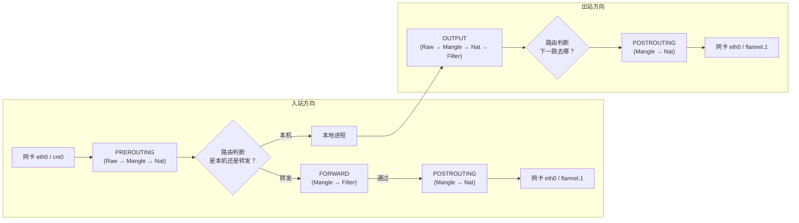
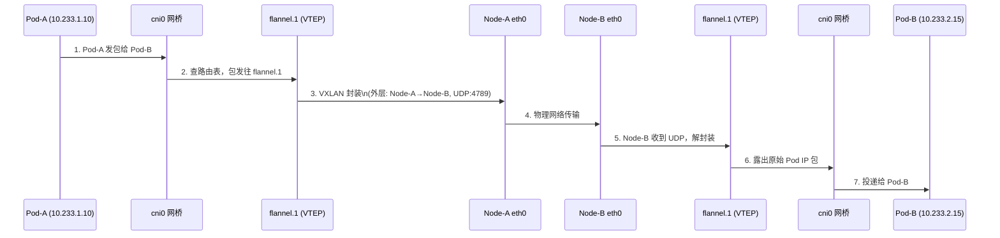
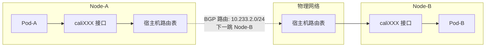
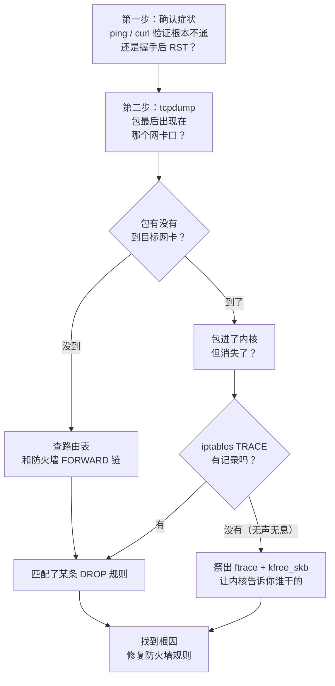

# Kubernetes Pod 网络数据包漂流记：跨节点通信与抓包实战

> 不知道你有没有这种感觉——应用日志打出来 "Connection Timeout"，但明明 ping 得通、端口也听着。问题到底出在哪儿？
>
> 这种"静默丢包"是 K8s 网络排障中最让人抓狂的场景。本文用图解 + 实战的方式，带你从 Pod 发包开始，一路追踪到内核深处，搞清楚数据包到底经历了什么、又在哪儿"失踪"。

## 先说个故事：包的一生

假设我们有两个 Pod，分别跑在两台 Node 上：

```
Node-A 上的 Pod-A（IP: 10.233.1.10）
        ↓
   发一个包去
        ↓
Node-B 上的 Pod-B（IP: 10.233.2.15）
```

这个包从 Pod-A 出来，到达 Pod-B，中间要过多少关卡？

**比你想象的要多得多。**

整个旅程涉及：Pod 的虚拟网卡 → 宿主机的网桥/接口 → 内核路由表 → Netfilter 防火墙规则 → CNI 隧道封装 → 物理网卡 → 目标节点的解封装 → 最后才到 Pod-B。

下面我们一步一步拆开来看。

## 第一关：Linux 内核的"流水线"——Netfilter 钩子

不管你用哪种 CNI（Flannel、Calico、Cilium），数据包在 Linux 宿主机上都要走同一条"流水线"，这条流水线就是 **Netfilter**。

Netfilter 在数据包经过内核协议栈时，提供了 5 个"安检口"（Hook）：



**几个关键点：**

- **PREROUTING**：常用于 DNAT（目标地址转换），K8s 中 kube-proxy 把 ClusterIP 转成具体 Pod IP 就发生在这里。
- **FORWARD**：**跨节点 Pod 通信的命门**。数据包从本机一个网卡进来，要从另一个网卡出去，就走这条链。如果这里被 DROP，包就无声无息地消失了。
- **POSTROUTING**：常用于 SNAT，比如 Pod 访问集群外部时，把源 IP 伪装（MASQUERADE）成宿主机的物理网卡 IP。

> **排查提示**：`net.ipv4.ip_forward` 必须为 1，否则内核根本不转发任何包。另外注意 `iptables -L -v -n` 看一下 FORWARD 链的默认策略是 ACCEPT 还是 DROP。

### iptables 和 nftables 的"双保险"陷阱

现在很多新系统默认启用了 `nftables`（比如 Ubuntu 22.04+），但 K8s 组件（kube-proxy）大量使用 `iptables`。

**巨坑来了**：两套规则必须**同时通过**。假设 nftables 的 FORWARD 链默认策略是 DROP，iptables 显示 ACCEPT——包在 iptables 那里过了，但在 nftables 那里被静默丢弃。这就是"静默丢包"最常见的原因之一。

## 第二关：主流 CNI 的流量路径对比

不同的 CNI 构建网络的思路完全不同，导致数据包经过的"道路"也不一样。

### 2.1 Flannel (VXLAN 模式)——穿隧道的高速公路

Flannel 是最早也是最经典的 CNI，VXLAN 模式通过在内核中建立 UDP 隧道，把 Pod 的 IP 包封装起来传输。



**抓包位置总结**：

| 排查点 | 命令 | 看什么 |
|--------|------|--------|
| Pod 的包到没到宿主机 | `tcpdump -i cni0 host 10.233.x.x` | 源/目的 IP 是否正确 |
| 包进没进隧道 | `tcpdump -i flannel.1 host 10.233.x.x` | 隧道内是否有包 |
| 物理网上有没有发出 | `tcpdump -i eth0 udp port 4789` | Node 间 UDP 封装包 |

### 2.2 Calico——用路由表指挥交通

Calico 走的是另一条路：不修隧道，而是把每台宿主机当成路由器，通过 BGP 协议同步路由表，让 Pod IP 直接在物理网络中可达。



Calico 有两种模式：

- **BGP 模式（纯三层）**：Pod 包不封装，直接从物理网卡发出。前提是底层网络允许这些 IP 路由——适合白盒可控的私有集群。
- **IPIP 模式（封装）**：包套一层 IP-in-IP（协议号 4），外层用宿主机 IP 做源/目的。比 VXLAN 简单，但性能损耗类似。

### 2.3 Cilium——用 eBPF 抄近道

Cilium 是最新一代的 CNI，它用 **eBPF** 在内核的网卡层面直接处理包，**大幅绕过 iptables 和路由表**。


**关键差异**：eBPF 程序挂载在网卡入口（ingress），数据包一进网卡就被 eBPF 拦截处理，不需要走完整的 Netfilter 流水线。所以传统的 `tcpdump` 在 Cilium 环境下可能抓不到这些包，需要用：

```bash
cilium monitor -v    # 监控 eBPF 层面的丢包和转发
hubble observe        # 带有 L7 协议解析的终极观测工具
```

## 第三关：实战抓包——三板斧定位静默丢包

排障思路很简单：**层层设卡，验证包死在哪个环节**。

### 第一板斧：tcpdump——包到哪了？

`tcpdump` 解决"包有没有到某个网卡"的问题。

```bash
# 在源节点执行，验证 Pod-A 的包有没有到宿主机网桥
tcpdump -i cni0 host 10.233.2.15 -n -nn

# 验证包有没有进入 flannel 隧道
tcpdump -i flannel.1 host 10.233.2.15 -n -nn

# 验证物理网卡有没有发出封装包
tcpdump -i eth0 udp port 4789 -n -nn
```

**实战经验**：不仅要关注包"有没有"，还要看 **Source IP 对不对**。有一次我们发现 TCP RST 的根因是 SNAT 选错了源 IP（选成了网关地址而非 Pod 地址），对端收到回复后不知道该交给哪个 Pod，直接发了 RST。

### 第二板斧：iptables TRACE——包在防火墙里去哪了？

如果 tcpdump 显示包进了 `cni0` 但没出 `flannel.1`，大概率死在 Netfilter 了。用 TRACE 目标打印包的"流水线游记"：

```bash
# 给特定流量打上 TRACE 标签
iptables -t raw -I PREROUTING -d 10.233.2.15 -p tcp --dport 9153 -j TRACE
iptables -t raw -I OUTPUT -d 10.233.2.15 -p tcp --dport 9153 -j TRACE

# 查看 TRACE 日志
tail -f /var/log/syslog | grep TRACE
# 或者新版内核用
nft monitor trace
```

输出的样子类似：

```
TRACE: raw:PREROUTING:rule:1  -->  mangle:FORWARD:rule:2  -->  filter:FORWARD:rule:3
```

如果包走到某一步突然没了，说明在那个链被 DROP 了。但这只是"显式规则"——如果是**默认策略 DROP**（比如 nftables），TRACE 也不会显示，因为没有规则匹配日志。

### 第三板斧：ftrace + kfree_skb——让内核亲口告诉你

这是终极手段。适用于：**tcpdump 看到包进了某网卡却没出来，iptables TRACE 显示一切正常（ACCEPT），但包就是消失了**——这是最诡异的"离奇失踪案"。

**原理**：Linux 内核中，无论因为什么理由丢弃一个包（skb, socket buffer），最终都会调用 `kfree_skb`。只要在这里挂个 hook，就能看到丢包的原因和调用栈。

```bash
# 进入 ftrace debug 目录
cd /sys/kernel/debug/tracing

# 关闭并清空旧的 trace
echo 0 > tracing_on
echo > trace

# 开启 kfree_skb 事件追踪
echo 1 > events/skb/kfree_skb/enable

# 打印调用栈——这是关键！
echo 1 > options/stacktrace

# 过滤 IP 协议（0x0800 = 2048），避免日志被刷爆
echo 'protocol == 2048' > events/skb/kfree_skb/filter

# 开始追踪
echo 1 > tracing_on

# 在另一个终端执行你的复现命令
# curl -v 10.233.2.15:9153

# 关闭并查看
echo 0 > tracing_on
cat trace | less
```

真实的排障案例输出：

```
kfree_skb: skbaddr=00000000b089b447 protocol=2048 location=0000000050342fbe reason: NETFILTER_DROP
 <stack trace>
 => kfree_skb_reason
 => nf_hook_slow        <-- Netfilter 慢速路径丢包
 => ip_forward          <-- 案发地点：IP 转发阶段（FORWARD 链）
 => ip_sublist_rcv_finish
 => ip_sublist_rcv
```

**抽丝剥茧**：

1. `reason: NETFILTER_DROP` — 明确是防火墙干的，排除硬件校验错误、路由黑洞。
2. `ip_forward` — 明确发生在跨接口转发阶段。
3. **矛盾点**：iptables TRACE 显示 ACCEPT，但这里显示 NETFILTER_DROP —— 说明还有另一套防火墙规则在拦截。

**最终真相**：系统里 Docker 自动生成了 nftables 规则，FORWARD 默认策略是 DROP。iptables 和 nftables 要同时通过，iptables 放行了没用，nftables 这里直接丢了。

**解法**：

```bash
nft add rule ip filter FORWARD counter accept
```

## 总结：侦探思维做网络排障



记住这四句口诀：

> **ping 不通查路由，握手 RST 查 SNAT。**
> **tcpdump 定点位，TRACE 追踪防火墙。**
> **离奇失踪用 ftrace，内核亲自告诉你。**

掌握这套方法论 + 工具组合，再复杂的 K8s 网络问题都能抽丝剥茧、精准定位。
