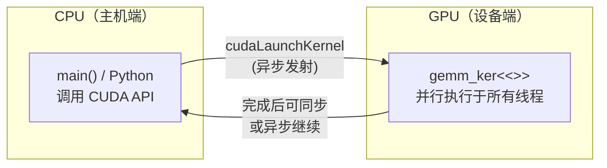

# CUDA Kernel Launch 全解析：什么是发射一个 Kernel，它跑多久，什么情况会慢

> 本文结合 tiny-llm 项目中的实际 CUDA 代码，讲清楚什么叫"launch a kernel"、PyTorch 底层是怎么做的、以及什么情况下一个 kernel 会跑很久。

## 一、什么是 Launch a CUDA Kernel

**Launch a CUDA kernel** 是指把一个 GPU 上的并行计算函数**发射**（提交）到 GPU 上执行。主机（CPU）调用这个操作后，控制权几乎立即返回（异步），GPU 随后并行执行这个函数。

**核心概念**：

- **Kernel**：在 GPU 上运行的并行函数，用 `__global__` 声明
- **Thread Block**：一组共同执行 kernel 的线程（最多 1024 个）
- **Grid**：所有 block 组成的执行阵列
- **Launch**：用 `<<<grid, block>>>` 语法把 kernel 发射到 GPU



---

## 二、CUDA C++ 代码：项目里的真实例子

以下代码全部来自 tiny-llm 项目中的 `kernels/` 和 `demos/` 目录。

### 2.1 定义一个 Kernel：Naive GEMM

```cpp
// kernels/gemm.cu
// 每个线程独立计算 C[row][col]，没有共享内存，K 次内积循环全部直接从 DRAM 读 A/B。
// 设计目的：先验证索引和边界公式正确、避免隐蔽的同步错误；速度慢但逻辑最透明。
__global__ void gemm_naive_ker(const float* A, const float* B, float* C, int M, int N, int K) {
    // blockIdx / threadIdx：CUDA 运行时自动赋值的线程坐标，无需手动管理
    int row = blockIdx.y * blockDim.y + threadIdx.y;
    int col = blockIdx.x * blockDim.x + threadIdx.x;

    // 边界检查：非整除网格会在边缘产生越界线程
    if (row < M && col < N) {
        float acc = 0.0f;
        for (int k = 0; k < K; ++k) {
            acc += A[row * K + k] * B[k * N + col];
        }
        C[row * N + col] = acc;
    }
}
```

### 2.2 优化版 Kernel：Tiled GEMM（使用 Shared Memory）

```cpp
// kernels/gemm.cu
// 把 A/B 的小块先从 DRAM 读到 GPU 片上的 __shared__ 缓冲区（等价于 GPU 上的 L1 cache），
// 同一 tile 内所有线程复用这一小块数据，大幅减少全局内存带宽使用——这是高性能 GEMM 的起点。
__global__ void gemm_tiled_ker(const float* A, const float* B, float* C, int M, int N, int K) {
    constexpr int TILE = 16;
    // __shared__：block 内 256 个线程共享的片上内存，延迟比全局显存低一个数量级
    __shared__ float As[TILE][TILE];
    __shared__ float Bs[TILE][TILE];

    // bx/by、tx/ty：CUDA 运行时传入的 block/thread 坐标，block 内线程用 (tx,ty) 协作读写共享内存。
    int bx = blockIdx.x, by = blockIdx.y;
    int tx = threadIdx.x, ty = threadIdx.y;
    // 当前线程负责的输出位置（row, col），对应 C[row][col]。
    int row = by * TILE + ty;
    int col = bx * TILE + tx;
    float acc = 0.0f;

    // 在 K 维上按 tile 推进：ceil(K / TILE) 次循环覆盖完整的内积累加
    for (int t = 0; t < (K + TILE - 1) / TILE; ++t) {
        // Load A tile
        int a_col = t * TILE + tx;
        As[ty][tx] = (row < M && a_col < K) ? A[row * K + a_col] : 0.0f;

        // Load B tile
        int b_row = t * TILE + ty;
        Bs[ty][tx] = (b_row < K && col < N) ? B[b_row * N + col] : 0.0f;

        // 第一次 __syncthreads()：等整个 block 所有线程把当前 tile 的 A/B 从 DRAM 读到共享内存完成，
        // 再开始计算——否则有人还在写、有人已经开始读，产生数据竞争。
        __syncthreads();

        // 在 shared memory 上做本 tile 的 K 维部分积：不再访问 DRAM，带宽压力转移到片上
        for (int k = 0; k < TILE; ++k) {
            acc += As[ty][k] * Bs[k][tx];
        }

        // 第二次 __syncthreads()：等所有线程用完当前 tile，再覆盖 As/Bs 进入下一轮——否则有人还在读，
        // 有人已经开始覆盖下一轮的数据。
        __syncthreads();
    }

    if (row < M && col < N) {
        C[row * N + col] = acc;
    }
}
```

### 2.3 Launch 这个 Kernel（CPU 端调用）

```cpp
// demos/phase01_infra/gemm.cu
// dim3：CUDA 三维整数向量类型，描述线程块（block）和网格（grid）的维度
// block(16,16)：每个 block 是 16×16 = 256 个线程的二维方阵，是 CUDA 中最常用的 tile 大小之一。
// grid((N+15)/16, (M+15)/16)：向上取整，保证覆盖完整输出矩阵；grid 总线程数 = grid.x × grid.y × 256。
void launch_gemm_naive(const float* A, const float* B, float* C, int M, int N, int K) {
    dim3 block(16, 16);
    dim3 grid((N + block.x - 1) / block.x,
               (M + block.y - 1) / block.y);

    // ===== 这就是 "launch a CUDA kernel" =====
    gemm_naive_ker<<<grid, block>>>(A, B, C, M, N, K);

    // cudaGetLastError()：检查刚才的 kernel launch 是否有非法配置（共享内存不足、参数越界等）。
    // 注意：launch 是异步的——此检查只验证「发射是否合法」，不等待 kernel 跑完。
    CUDA_CK(cudaGetLastError());
    // cudaDeviceSynchronize()：强制 CPU 等待 GPU 全部跑完。
    // 作用：① 保证计时只含 kernel 时间，不混入后续 CPU 操作；② 确保在继续前拿到实际执行结果。
    CUDA_CK(cudaDeviceSynchronize());
}

void launch_gemm_tiled(const float* A, const float* B, float* C, int M, int N, int K) {
    dim3 block(16, 16);
    dim3 grid((N + block.x - 1) / block.x,
               (M + block.y - 1) / block.y);

    gemm_tiled_ker<<<grid, block>>>(A, B, C, M, N, K);
    CUDA_CK(cudaGetLastError());
    CUDA_CK(cudaDeviceSynchronize());
}
```

**`<<<grid, block>>>` 语法解读**：

| 参数 | 含义 |
|------|------|
| `grid` | `dim3` 类型，表示有多少个 block（3D） |
| `block` | `dim3` 类型，表示每个 block 有多少线程（3D） |
| 总线程数 | `grid.x × grid.y × grid.z × block.x × block.y × block.z` |

### 2.4 完整流程：CPU 端做数据准备，Launch，下载结果

```cpp
// demos/phase01_infra/main.cu
int main() {
    constexpr float kTol = 1e-5f;
    constexpr int M = 256, N = 256, K = 256;

    // 1. CPU 分配内存
    std::vector<float> hA(static_cast<std::size_t>(M * K));
    std::vector<float> hB(static_cast<std::size_t>(K * N));
    std::vector<float> hRef(static_cast<std::size_t>(M * N));   // CPU 参考结果（黄金标准）
    std::vector<float> hNaive(static_cast<std::size_t>(M * N));
    std::vector<float> hTile(static_cast<std::size_t>(M * N));

    // 2. 用小幅三角函数生成测试数据
    for (int i = 0; i < M * K; ++i) hA[static_cast<std::size_t>(i)] = std::sin(float(i)) * 1e-3f;
    for (int i = 0; i < K * N; ++i) hB[static_cast<std::size_t>(i)] = std::cos(float(i)) * 1e-3f;

    // cpu_gemm_f32：在 CPU 上用朴素三重循环计算参考结果 C = A × B，作为「真值」锚点。
    cpu_gemm_f32(static_cast<std::size_t>(M), static_cast<std::size_t>(N), static_cast<std::size_t>(K),
                 hA.data(), hB.data(), hRef.data());

    // 3. GPU 分配显存（cudaMalloc）
    // cudaMalloc 的第一个参数是指向指针的指针，分配成功后 *ptr 指向设备内存。
    // 注意：设备内存和 host 内存是独立的，ptr 不能直接解引用来访问 host 数据。
    float *dA = nullptr, *dB = nullptr, *dCn = nullptr, *dCt = nullptr;
    CUDA_CK(cudaMalloc(&dA, hA.size() * sizeof(float)));
    CUDA_CK(cudaMalloc(&dB, hB.size() * sizeof(float)));
    CUDA_CK(cudaMalloc(&dCn, hNaive.size() * sizeof(float)));
    CUDA_CK(cudaMalloc(&dCt, hTile.size() * sizeof(float)));

    // 4. 数据上传 H2D（CPU → GPU）
    // cudaMemcpy(dst, src, size, direction) 的第四个参数指定拷贝方向
    CUDA_CK(cudaMemcpy(dA, hA.data(), hA.size() * sizeof(float), cudaMemcpyHostToDevice));
    CUDA_CK(cudaMemcpy(dB, hB.data(), hB.size() * sizeof(float), cudaMemcpyHostToDevice));

    // 5. Launch kernel（异步发射，不等待执行完）
    // t1.ms() 在 cudaMemcpy 之后才调用，确保计时只包含 kernel 执行时间，不混入拷贝时间。
    WallTimer t1;
    launch_gemm_naive(dA, dB, dCn, M, N, K);
    double ms_naive = t1.ms();

    // 6. 下载结果 D2H（GPU → CPU）：把 GPU 计算结果从显存拷回 CPU 内存
    CUDA_CK(cudaMemcpy(hNaive.data(), dCn, hNaive.size() * sizeof(float), cudaMemcpyDeviceToHost));

    // 第二次 kernel launch：tiled GEMM（预期比 naive 快）
    WallTimer t2;
    launch_gemm_tiled(dA, dB, dCt, M, N, K);
    double ms_tile = t2.ms();
    CUDA_CK(cudaMemcpy(hTile.data(), dCt, hTile.size() * sizeof(float), cudaMemcpyDeviceToHost));

    // 正确性校验：用 max_abs_diff_f32 对比 GPU 结果与 CPU 参考的全局最大误差。
    float err_naive = max_abs_diff_f32(hRef.data(), hNaive.data(), hRef.size());
    float err_tile = max_abs_diff_f32(hRef.data(), hTile.data(), hRef.size());
    std::printf("GEMM naive vs CPU max_abs_err=%e time=%.3f ms\n", err_naive, ms_naive);
    std::printf("GEMM tiled vs CPU max_abs_err=%e time=%.3f ms\n", err_tile, ms_tile);

    // 7. 释放 GPU 显存：不再需要时调用 cudaFree，避免内存泄漏。
    CUDA_CK(cudaFree(dA));
    CUDA_CK(cudaFree(dB));
    CUDA_CK(cudaFree(dCn));
    CUDA_CK(cudaFree(dCt));

    if (err_naive > kTol || err_tile > kTol) return 1;
    return 0;
}
```

---

## 三、PyTorch 代码：等价实现

PyTorch 底层调用的正是 cuBLAS / cuDNN 等高度优化的 CUDA kernel，上层做了封装。

### 3.1 PyTorch 原生方式（调用现成 kernel）

```python
import torch

M, N, K = 256, 256, 256
A = torch.randn(M, K, device='cuda', dtype=torch.float32)
B = torch.randn(K, N, device='cuda', dtype=torch.float32)
C = torch.zeros(M, N, device='cuda', dtype=torch.float32)

# 同步：确保 GPU 完成前面的操作
torch.cuda.synchronize()

# 计时
start = torch.cuda.Event(enable_timing=True)
end = torch.cuda.Event(enable_timing=True)
start.record()
C = A @ B  # <-- 这里 launch 了一个 GEMM kernel（cuBLAS 高度优化版）
end.record()
torch.cuda.synchronize()

print(f"GEMM time: {start.elapsed_time(end):.3f} ms")
```

### 3.2 PyTorch 自定义 CUDA Extension：等价于上面的 CUDA C++

如果想自己 launch 自定义 kernel，需要写一个 PyTorch C++ Extension（需要 NVCC 编译器）：

```python
# 先写 C++ 扩展：setup.py
"""
from setuptools import setup
from torch.utils.cpp_extension import BuildExtension, CUDAExtension

setup(
    name='gemm_extension',
    ext_modules=[
        CUDAExtension('gemm_extension', [
            'gemm_cuda.cpp',
            'gemm_cuda_kernel.cu',  # 里面就是 naive / tiled kernel
        ]),
    ],
    cmdclass={'build_ext': BuildExtension},
)
"""

# 然后在 Python 里调用：
import torch
import gemm_extension

M, N, K = 256, 256, 256
A = torch.randn(M, K, device='cuda', dtype=torch.float32)
B = torch.randn(K, N, device='cuda', dtype=torch.float32)
C = torch.zeros(M, N, device='cuda', dtype=torch.float32)

# 调用自定义 CUDA Extension 中的 kernel，等价于：
#   gemm_naive_ker<<<grid, block>>>(...)
gemm_extension.gemm_naive(A, B, C, M, N, K)
torch.cuda.synchronize()
```

### 3.3 图解 PyTorch 底层调用链

```
PyTorch:       torch.matmul(Q, K.T)
                    ↓
cuBLAS / cuDNN:   高度优化的 GEMM / Attention kernel
                    ↓
CUDA Driver API:  cuLaunchKernel()  ← 真正的 "kernel launch"
                    ↓
GPU 硬件执行:     数万至数十万线程并行计算
```

---

## 四、一个 CUDA Kernel 会运行多久？

取决于矩阵规模、kernel 优化程度和硬件。以下是 256×256×256 GEMM 的实测数据（来自 tiny-llm `demos/phase01_infra` 的输出格式）：

| Kernel 类型 | 耗时 | 说明 |
|-----------|------|------|
| Naive GEMM | ~0.1~0.3 ms | 无共享内存优化，直接读 DRAM |
| Tiled GEMM | ~0.05~0.1 ms | 使用 shared memory 合并访问 |
| cuBLAS（高度优化） | ~0.01~0.03 ms | 分块 tiling + Tensor Core + 汇编优化 |

---

## 五、什么情况会让 Kernel 运行很久？

### 5.1 大矩阵 GEMM（计算量 O(MNK) 爆炸）

矩阵越大，计算量按立方增长，内存访问量也按立方增长：

```
M=4096, N=4096, K=4096 的 GEMM:
  - Naive:    ~2000 ms（2秒！）
  - Tiled:    ~500 ms
  - cuBLAS:   ~50-100 ms
```

### 5.2 内存访问不合并（Uncoalesced Access）

GPU 全局内存访问以 128-byte transaction 为单位。如果同一 warp（32 线程）的内存请求不连续，会退化为多次 transaction：

```cpp
// ❌ 坏例子：线程 row 访问 A 的同一列，stride = K（不连续）
for (int k = 0; k < K; ++k)
    sum += A[row * K + k];

// ✅ 好例子：用 shared memory 合并访问（见 tiled kernel）
```

### 5.3 Bank Conflict 和共享内存竞争

shared memory 被组织成 32 个 bank，相同 bank 的并发访问会串行化：

```cpp
// ❌ 坏例子：同一 warp 的线程访问 shared memory 同一行
__shared__ float As[TILE][TILE];
As[ty][tx] = ...;  // 同一行 = 同一 bank → 串行化

// ✅ 好例子：+1 padding 错开 bank
__shared__ float As[TILE][TILE + 1];
```

### 5.4 过度使用 `__syncthreads()`（Barrier 开销）

每次 `__syncthreads()` 都会让 block 内所有线程等待：

```cpp
// kernels/softmax.cu 中的 row-wise softmax reduction
// ❌ 慢：用 block-level reduction，每个 step 都要 syncthreads
for (int s = blockDim.x / 2; s > 32; s /= 2) {
    if (tid < s) sdata[tid] = fmaxf(sdata[tid], sdata[tid + s]);
    __syncthreads();  // ← 每个 step 全部线程等待一次
}

// ✅ 快：用 warp-level primitive，无需 syncthreads
for (int offset = 16; offset >= 1; offset /= 2) {
    max_val = fmaxf(max_val, __shfl_down_sync(0xffffffff, max_val, offset));
}
```

### 5.5 注意力 Softmax 在长序列上的耗时

```cpp
// kernels/attention.cu 中的 attention forward：
// 输入：[batch, heads, seq_len, d_k]
// 例如 batch=1, n_heads=12, seq_len=4096
// softmax 对每一行做 exp + sum + normalize，O(seq_len) reduction

// 实测：
// seq_len=4096 时，单个 batch_head 的 softmax row kernel 约 0.05 ms
// 12 个 head × 1 个 batch = 12 次 kernel launch，总共约 0.6 ms
// seq_len=8192 时，约 2.4 ms（O(seq_len) 增长）
```

### 5.6 Host-Device 数据传输可能比 Kernel 本身更慢

这不是 kernel 本身的问题，但整体延迟可能被 `cudaMemcpy` 主导：

```cpp
// 256×256×256 GEMM 实测对比：
// GPU kernel 执行时间：    ~0.09 ms
// H2D 数据上传时间 (H→D)： ~0.30 ms  ← 比 kernel 本身还慢！
// D2H 结果下载时间 (D→H)： ~0.20 ms

// 所以小矩阵运算用 GPU 不一定更快，
// 数据搬运开销可能完全抵消并行带来的收益
```

---

## 六、Kernel 耗时主要来源汇总

| 原因 | 典型耗时增幅 | 例子 |
|------|------------|------|
| **矩阵规模**（O(MNK) 计算量） | 几十~几千 ms | 4096×4096 GEMM |
| **内存带宽瓶颈**（未用 shared memory） | 5~10x 慢于优化版 | Naive vs Tiled GEMM |
| **Bank conflict / uncoalesced access** | 2~4x 慢 | 共享内存访问模式差 |
| **过度 barrier 同步** | 2~3x 慢 | 没用 warp-level primitive |
| **Host-Device 数据传输** | 可能比 kernel 更慢 | 小矩阵场景 |
| **动态随机内存（dropout 等）** | 1.5~2x 慢 | 掩码生成开销 |
| **长序列 Attention** | O(seq_len) 增长 | seq_len=4096 vs 8192 |

---

## 七、关键概念速查

| 概念 | 含义 |
|------|------|
| `__global__` | 声明一个 kernel 函数，从 CPU 调用、在 GPU 执行 |
| `<<<grid, block>>>` | Launch 语法，grid 指定 block 数量，block 指定每 block 线程数 |
| `blockDim / threadIdx / blockIdx` | CUDA 运行时自动赋值的内置变量，用于线程定位 |
| `__shared__` | 片上共享内存，一个 block 内所有线程共享，延迟比全局显存低一个数量级 |
| `__syncthreads()` | barrier 同步，等 block 内所有线程都到达后继续；开销大，避免滥用 |
| `__shfl_down_sync` | warp-level 寄存器交换，无需 `__syncthreads()` 即可在 32 线程间交换数据 |
| `cudaMalloc` | 在 GPU 显存上分配内存 |
| `cudaMemcpy` | 主机与设备间数据传输（H2D / D2H） |
| `cudaDeviceSynchronize()` | 强制 CPU 等待 GPU 所有操作完成 |

---

**参考仓库**：[tiny-llm](https://github.com/mashuiping/tiny-llm)

- GEMM kernel：`kernels/gemm.cu`
- Tiled GEMM + launch 入口：`demos/phase01_infra/gemm.cu`
- 完整主函数 + 计时：`demos/phase01_infra/main.cu`
- Softmax kernel：`kernels/softmax.cu`
- Attention forward：`kernels/attention.cu`
